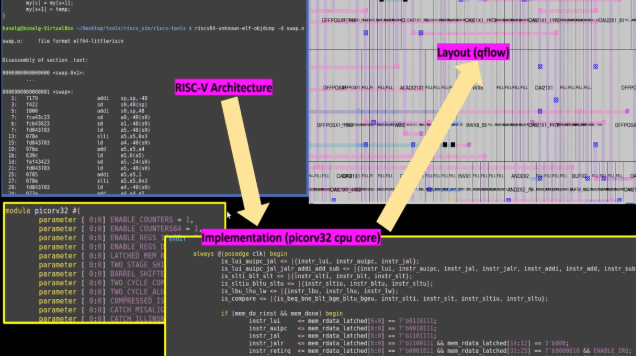
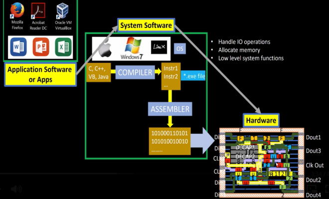

# 0 - Introduction to QFN-48 Package, Chip, Pads, Core, Die and IPs

## Package Architecture

### IC Package Components

An integrated circuit consists of two main components:

- **Package**: The protective outer casing that houses the silicon chip
- **Chip**: The actual piece of silicon containing the circuit functionality

### Package-to-Chip Interface

The package serves as an interface between the fragile silicon die and the external world:

- **Protection**: Shields the delicate silicon from environmental damage
- **Electrical Connection**: Connects internal silicon I/O pads to external package pins
- **Thermal Management**: Provides heat dissipation pathways
- **Mechanical Support**: Offers structural integrity for handling and mounting


## Chip Components and Architecture

### Internal Chip Structure

Modern chips are composed of several key elements:

#### Foundry IPs (Intellectual Property)

- **Definition**: Pre-designed, process-specific circuit blocks
- **Examples**: Analog-to-Digital Converters (ADCs), Static Random Access Memory (SRAM)
- **Characteristics**:
  - Optimized for specific foundry processes
  - Provided by foundry or licensed from IP vendors
  - Highly specialized and process-dependent
  - Require minimal customization

#### Macros

- **Definition**: Reusable digital circuit blocks
- **Examples**: Processors, memory controllers, interface blocks
- **Characteristics**:
  - Larger than standard cells
  - Can be synthesized or hard macros
  - Often customer-designed or third-party licensed
  - May require placement and routing considerations


### Die vs. Core vs. Pads

- **Die**: The entire silicon piece, including both active circuitry and I/O
- **Core**: The central area containing the main logic and functionality
- **Pads**: I/O interface structures located around the periphery

## Instruction Set Architecture (ISA)

### ISA Fundamentals

The Instruction Set Architecture defines the interface between software and hardware:

#### Key Characteristics:

- **Low-level interface**: Provides the most basic operations available to software
- **Instruction types**: Arithmetic, logical, memory access, control flow
- **Register organization**: Defines available registers and their purposes
- **Memory model**: Specifies how memory is addressed and accessed

#### Common ISA Operations:

- **Arithmetic**: ADD, SUB, MUL, DIV
- **Logical**: AND, OR, XOR, NOT
- **Memory**: LOAD, STORE
- **Control**: BRANCH, JUMP, CALL, RETURN
- **System**: Interrupt handling, privilege modes

### Software-to-Hardware Translation

The ISA serves as the translation layer:

1. **High-level code** → Compiler → **Assembly language**
2. **Assembly language** → Assembler → **Machine code**
3. **Machine code** → CPU → **Hardware execution**

# 1 - Introduction to RISC-V

## RISC-V: Reduced Instruction Set Computer V

### Open Source ISA Revolution

#### Key Advantages:

- **Open Source**: No licensing fees or restrictions
- **Modular Design**: Base instruction set plus optional extensions
- **Academic and Commercial Use**: Suitable for research and production

#### Comparison with Proprietary ISAs:

- **x86**: Complex instruction set, Intel/AMD licensing
- **ARM**: Reduced instruction set, ARM Holdings licensing
- **RISC-V**: Open, free, extensible architecture

### RISC-V Architecture Features:

- **Base Integer ISA**: RV32I, RV64I, RV128I
- **Standard Extensions**: M (multiply/divide), A (atomic), F (single-precision floating-point), D (double-precision floating-point), C (compressed)
- **Custom Extensions**: Allows for specialized instructions
- **Privileged Architecture**: Supports multiple privilege levels

# 2 - From Software Applications to Hardware

## Software Compilation Flow

### Multi-Stage Translation Process

The journey from high-level programming languages to hardware execution involves several stages:

#### Stage 1: High-Level Language to Assembly

- **Input**: C++, Java, Python, Rust, etc.
- **Process**: Compilation with language-specific compilers
- **Output**: Assembly language specific to target ISA
- **Tools**: GCC, Clang, LLVM

#### Stage 2: Assembly to Machine Code

- **Input**: Assembly language instructions
- **Process**: Assembly using assembler tools
- **Output**: Binary machine code (object files)
- **ISA Dependency**: Output format depends on target architecture

#### Stage 3: Linking and Executable Generation

- **Input**: Object files and libraries
- **Process**: Linking resolves symbols and creates final executable
- **Output**: Executable binary file
- **Loader**: Operating system loads executable into memory




### Cross-Platform Considerations:

- **Architecture-Specific**: Executables are tied to specific ISA
- **ABI Compatibility**: Application Binary Interface defines calling conventions
- **Endianness**: Byte ordering differences between architectures
- **Register Usage**: Different ISAs have varying register file organizations

# 3 - Introduction to All Components of Open-Source Digital ASIC Design

## Process Design Kit (PDK) Revolution

### Historical Context

Traditionally, PDKs were closely guarded proprietary assets:

- **Foundry Control**: Only provided to select customers
- **High Barriers**: Expensive licensing and NDAs required
- **Limited Access**: Restricted academic and research use
- **Innovation Bottleneck**: Slowed open-source hardware development

### Essential PDK Components

A complete PDK provides designers with all necessary files for silicon design:

#### Process Design Rules

- **Geometric Constraints**: Minimum feature sizes, spacing rules
- **Layer Definitions**: Metal, via, and active layer specifications
- **Design Rule Checking (DRC)**: Automated verification rules
- **Manufacturability Guidelines**: Yield optimization recommendations

#### Device Models

- **SPICE Models**: Transistor electrical characteristics
- **Verilog Models**: Digital behavioral models
- **Parasitic Extraction**: RC extraction rules and models
- **Corner Analysis**: Process, voltage, temperature variations

#### Standard Cell Libraries

- **Logic Gates**: Basic combinational logic (AND, OR, NAND, NOR, XOR)
- **Sequential Elements**: Flip-flops, latches, memory elements
- **Complex Cells**: Multiplexers, adders, buffers
- **Characterization Data**: Timing, power, and area information

#### I/O Libraries

- **Pad Cells**: Input, output, bidirectional I/O structures
- **Power Pads**: Supply and ground connections

### SKY130

- **First Open-Source PDK**: Fully open and freely available
- **Complete Ecosystem**: Full design-to-manufacturing capability
- **Educational Impact**: Enables widespread ASIC design education

#### 130nm Technology Node Characteristics:


#### Performance Capabilities:

- **Operating Frequency**: Up to 1GHz with proper pipelining
- **Applications**: Entrylevel digital designs, IoT devices, educational projects
- **Market Relevance**: Still significant for cost-sensitive applications

#### Market Share:


# 4 - Simplified RTL to GDSII Flow

## Overview of the Digital Design Flow

### RTL (Register Transfer Level)

RTL represents the digital circuit at an abstract level:

- **Behavioral Description**: Describes what the circuit does, not how it's implemented
- **Language**: Typically written in Verilog or VHDL
- **Abstraction Level**: Higher than gate-level, lower than algorithmic
- **Timing**: Synchronous behavior described with clock edges

## Synthesis: RTL to Gates

### Synthesis Process

The synthesis step transforms behavioral RTL into a structural gate-level representation:

#### Tools Used:

- **yosys**: Open-source synthesis tool for Verilog RTL
- **abc**: Technology mapping and logic optimization
- **OpenSTA**: Static timing analysis for post-synthesis verification

#### Synthesis Steps:

1. **RTL Analysis**: Parse and elaborate the RTL description
2. **Logic Optimization**: Minimize logic while preserving functionality
3. **Technology Mapping**: Map optimized logic to standard cells
4. **Timing Analysis**: Verify timing constraints are met

### Standard Cell Libraries

#### Standard Cell Characteristics:

- **Regular Layout**: Consistent height, variable width
- **Functional Variety**: Logic gates, flip-flops, buffers, complex functions
- **Multiple Formats**: Abstract, behavioral, physical, timing views

#### Cell Types:

- **Combinational Logic**:
  - Basic gates: Inverters (INV), NAND, NOR, AND, OR
  - Complex gates: AOI (AND-OR-INVERT), OAI (OR-AND-INVERT)
  - Arithmetic: Full adders, multiplexers
- **Sequential Elements**:
  - D flip-flops with various features (reset, enable)
  - Latches for special timing requirements
- **Special Cells**:
  - Clock buffers and clock gates
  - Level shifters for multi-voltage designs

#### Multiple Cell Views:

- **Electrical**: SPICE netlist for analog simulation
- **HDL**: Verilog/VHDL behavioral models
- **Physical**: Layout (GDSII) and abstract (LEF) views
- **Timing**: Liberty format (.lib) with delay and power data

## Floorplanning: Chip-Level Architecture

### Floorplanning Objectives

Floorplanning establishes the overall chip architecture without placing individual cells:

#### Tools Used:

- **init_fp**: Defines core area, rows, and routing tracks
- **ioplacer**: Places macro input and output ports
- **pdngen**: Generates the power distribution network
- **tapcell**: Inserts well-tap and decap cells

#### Key Floorplanning Tasks:

##### Die and Core Definition

- **Die Size**: Overall chip dimensions based on functionality and I/O requirements
- **Core Area**: Internal region for standard cell placement
- **Aspect Ratio**: Width-to-height ratio affecting routability and performance
- **Utilization**: Ratio of cell area to available core area


##### I/O Planning

- **Pin Assignment**: Strategic placement of I/O pins
- **Signal Integrity**: Minimize noise and interference
- **Package Considerations**: Match pin locations to package requirements
- **Power and Ground**: Distribute supply pins uniformly

### Macro Floorplanning

For designs containing large blocks (macros):

#### Macro Placement Considerations:

- **Connectivity**: Place related macros close together
- **Data Flow**: Align macros with primary data paths
- **Clock Distribution**: Minimize clock skew between macros
- **Power Planning**: Ensure adequate power delivery to all macros

### Power Planning

Power distribution is critical for chip functionality:

#### Power Network Components:

- **Power Rails**: Primary distribution from pads to core
- **Power Rings**: Secondary distribution around chip periphery
- **Power Stripes**: Regular grid for uniform power delivery
- **Via Stacks**: Vertical connections between metal layers


#### Multi-Rail Power Systems:

- **Core Power**: Primary logic supply (e.g. 1.8V)
- **I/O Power**: Interface supply (e.g. 3.3V)
- **Analog Power**: Clean supply for sensitive circuits
- **Power Islands**: Different voltage domains within the same chip

## Placement: Cell-Level Positioning

### Placement Objectives

Placement determines the exact location of each standard cell within the core area:

#### Tools Used:

- **RePLace**: Global placement using analytical techniques
- **Resizer**: Buffer insertion and gate sizing optimization
- **OpenDP**: Detailed placement for legalization


### Two-Stage Placement Process:

#### Global Placement

- **Objective**: Minimize wirelength while satisfying density constraints
- **Method**: Analytical or partitioning-based algorithms
- **Output**: Approximate cell positions (may have overlaps)
- **Optimization**: Focuses on connectivity and timing

#### Detailed Placement

- **Objective**: Legalize global placement results
- **Method**: Incremental improvement and local optimization
- **Output**: Legal, non-overlapping cell positions
- **Constraints**: Respect placement rows and site boundaries

### Placement Quality Metrics:

- **Wirelength**: Total interconnect length
- **Timing**: Meeting setup and hold time requirements
- **Congestion**: Avoiding routing resource conflicts
- **Power**: Minimizing switching activity and leakage

## Clock Tree Synthesis (CTS)

### Clock Distribution Challenges

The clock signal must reach all sequential elements with minimal skew:

#### Design Objectives:

- **Low Skew**: Minimize timing differences between clock endpoints
- **Low Latency**: Reduce clock insertion delay
- **Power Efficiency**: Minimize clock power consumption
- **Jitter Control**: Maintain signal integrity

#### Tool Used:

- **TritonCTS**: Clock tree synthesis and optimization

### Clock Tree Structures:

#### Tree Topologies:

- **H-Tree**: Symmetric tree structure for regular designs
- **Fish-bone**: Optimized for rectangular layouts
- **Multi-level**: Hierarchical distribution for large designs


#### Clock Tree Elements:

- **Clock Buffers**: Drive strength optimization
- **Clock Gates**: Power reduction through selective disabling
- **Clock Muxes**: Multiple clock domain selection
- **Balancing Buffers**: Skew minimization

### Clock Domain Considerations:

- **Single Clock**: Simplest case with one global clock
- **Multiple Clocks**: Different frequency domains
- **Clock Crossing**: Synchronization between domains
- **Reset Distribution**: Reset signal coordination with clock

## Routing: Physical Interconnect

### Routing Objectives

Routing creates the actual metal wire connections between all circuit elements:

#### Tools Used:

- **FastRoute**: Global routing with congestion awareness
- **TritonRoute**: Detailed routing with design rule compliance
- **OpenRCX**: Parasitic extraction for timing closure


### Two-Stage Routing Process:

#### Global Routing

- **Objective**: Determine routing regions for each net
- **Method**: Graph-based algorithms on routing grid
- **Output**: Routing guides for detailed router
- **Optimization**: Minimize congestion and via usage

#### Detailed Routing

- **Objective**: Create actual physical wires
- **Method**: Track assignment and via insertion
- **Output**: Complete routing with DRC compliance
- **Constraints**: Metal width, spacing, and via rules

### Routing Challenges:

- **Congestion**: Limited routing resources in dense areas
- **Via Minimization**: Reduce inter-layer connections
- **Antenna Effects**: Long wires can damage gates during manufacturing
- **Crosstalk**: Signal integrity between adjacent wires

### Multi-Layer Routing:

- **Layer Assignment**: Different functions for different metal layers
- **Preferred Direction**: Alternating horizontal/vertical layers
- **Via Planning**: Minimize layer transitions
- **Power/Ground**: Dedicated layers for supply distribution

## Sign-Off: Design Verification

### Physical Verification

#### Design Rules Checking (DRC)

Ensures the layout is manufacturable:

- **Geometric Rules**: Minimum widths, spacings, and enclosures
- **Layer-Specific**: Rules vary by metal layer and device type
- **Density Rules**: Metal fill requirements for chemical-mechanical polishing
- **Via Rules**: Inter-layer connection requirements

#### Layout vs. Schematic (LVS)

Verifies logical equivalence between layout and netlist:

- **Netlist Extraction**: Extract connectivity from physical layout
- **Comparison**: Match extracted netlist with original schematic
- **Device Matching**: Verify transistor sizes and connections
- **Error Resolution**: Debug and fix mismatches

### Timing Verification

#### Static Timing Analysis (STA)

##### Timing Path Analysis:

- **Setup Time**: Data must be stable before clock edge
- **Hold Time**: Data must remain stable after clock edge
- **Clock-to-Q**: Propagation delay through flip-flops
- **Combinational Delay**: Logic gate propagation times

# 5 - Introduction to OpenLANE and Strive Chipsets

## OpenLANE: Complete RTL-to-GDSII Flow

### OpenLANE Overview

OpenLANE is an automated RTL-to-GDSII flow that integrates multiple open-source EDA tools


### OpenLANE Project Structure

#### Directory Organization:

```
<design_name>
├── config.json/config.tcl          # Design configuration
├── runs                            # Execution results
│   ├── <tag>                      # Specific run identifier
│   │   ├── config.tcl             # Run-specific configuration
│   │   ├── {logs, reports, tmp}   # Process information
│   │   │   ├── cts               # Clock tree synthesis
│   │   │   ├── signoff           # Final verification
│   │   │   ├── floorplan         # Chip planning
│   │   │   ├── placement         # Cell placement
│   │   │   ├── routing           # Interconnect routing
│   │   │   └── synthesis         # RTL synthesis
│   │   ├── results               # Output files
│   │   │   ├── final             # Complete GDSII
│   │   │   ├── cts               # Post-CTS results
│   │   │   ├── signoff           # Verification reports
│   │   │   ├── floorplan         # Floorplan files
│   │   │   ├── placement         # Placement results
│   │   │   ├── routing           # Routing database
│   │   │   └── synthesis         # Synthesized netlist
```

### Design Goals and Capabilities

#### Primary Objective

Achieve "no human intervention" RTL-to-GDSII flow:

- **Automated Decision Making**: Tool parameter optimization
- **Error Handling**: Automatic recovery from common issues
- **Quality Metrics**: Built-in design quality assessment
- **Tape-out Ready**: Production-quality results

#### Pre-configured Design Library

OpenLANE includes numerous validated reference designs:

- **Processor Cores**: RISC-V implementations
- **Peripheral Controllers**: UART, SPI, I2C interfaces
- **Crypto Engines**: AES, hash function implementations
- **Test Circuits**: Various complexity levels for validation

### Execution Modes

#### Interactive Mode

Allows step-by-step execution with parameter tuning:

#### Autonomous Mode

Fully automated execution based on configuration:

## Strive SoC Family

### System-on-Chip Architecture

Strive represents a family of complete SoC implementations using Sky130 technology:


#### SoC Components:

- **Processor Core**: RISC-V CPU implementation
- **Memory Subsystem**: On-chip SRAM and cache hierarchy

# 6 - Introduction to OpenLANE Detailed ASIC Design Flow

## Advanced Flow Control and Optimization

### Synthesis Exploration

#### Design Space Exploration

Synthesis exploration helps identify optimal synthesis strategies.


### Design Exploration Framework

The `-synth_explore` option provides comprehensive design analysis:


#### Exploration Outputs:

- **Area Reports**: Silicon area utilization analysis
- **Timing Reports**: Critical path and slack analysis
- **Power Estimates**: Dynamic and static power projections
- **Resource Utilization**: Logic and routing resource usage

#### Decision Support:

- **Ranked Results**: Automatically sorted by optimization criteria

### Regression Testing Framework

OpenLANE includes comprehensive regression testing capabilities:


#### Quality Metrics:

- **Timing Closure**: Meet all timing constraints
- **Area Efficiency**: Optimize silicon utilization
- **Power Consumption**: Minimize energy requirements
- **Yield Prediction**: Estimate manufacturing success rate

## Design for Test (DFT)

### Test Infrastructure Integration

Modern chips require comprehensive test capabilities:

#### Scan Chain Implementation

- **Scan Flip-flops**: Replace regular flip-flops with testable versions

#### Automatic Test Pattern Generation (ATPG)

Systematic generation of test vectors:

##### Fault Models:

- **Stuck-at Faults**: Signals permanently stuck at logic 0 or 1
- **Transition Faults**: Delays causing timing failures
- **Bridging Faults**: Unintended connections between signals

## Logic Equivalence Checking (LEC)

### Verification Methodology

LEC ensures functional correctness throughout the design flow:

#### Verification Points:

- **Post-Synthesis**: RTL vs. gate-level netlist
- **Post-Placement**: Before and after placement optimization
- **Post-Routing**: Before and after routing changes

## Physical Design Challenges and Solutions

### Antenna Rule Violations

#### Antenna Effect Physics

Long metal wires can accumulate charge during manufacturing:

- **Charge Accumulation**: Plasma etching process deposits charge
- **Gate Damage**: Excessive charge can damage thin gate oxides
- **Yield Impact**: Antenna violations reduce manufacturing yield


#### Antenna Violation Fixes:

- **Antenna Diodes**: Provide discharge path for accumulated charge
- **Wire Segmentation**: Break long wires with intermediate connections
- **Layer Jumping**: Use multiple metal layers to reduce effective wire length
- **Buffer Insertion**: Add intermediate stages to break long paths

### Design Rule Checking (DRC)

#### Manufacturing Constraint Verification

DRC ensures the layout can be successfully manufactured:

#### Rule Categories:

- **Minimum Width**: Ensure features can be reliably printed
- **Minimum Spacing**: Prevent shorts between adjacent features
- **Via Rules**: Ensure reliable inter-layer connections
- **Density Rules**: Meet chemical-mechanical polishing requirements

### Layout Versus Schematic (LVS)

#### Connectivity Verification

LVS confirms physical layout matches logical design:

#### Common Issues:

- **Shorts**: Unintended connections between nets

  - Power-ground shorts are most critical
  - Signal shorts cause functional failures
  - Detection through careful layout review
  - Prevention through proper design rules

- **Opens**: Missing connections in the layout

  - Incomplete routing between components
  - Missing vias between metal layers
  - Broken connections due to DRC fixes
  - Detection through connectivity extraction

- **Missing Components**: Layout doesn't include all schematic elements
  - Forgotten transistors or passive components
  - Incorrect component parameters
  - Version mismatch between scheatic and layout

## Static Timing Analysis (STA)

### Comprehensive Timing Verification

STA provides thorough timing analysis without requiring functional simulation:

#### Timing Path Analysis:

- **Setup Analysis**: Ensure data arrives before clock edge
- **Hold Analysis**: Ensure data remains stable after clock edge
- **Clock Analysis**: Verify clock distribution quality
- **Power Analysis**: Estimate dynamic power consumption
