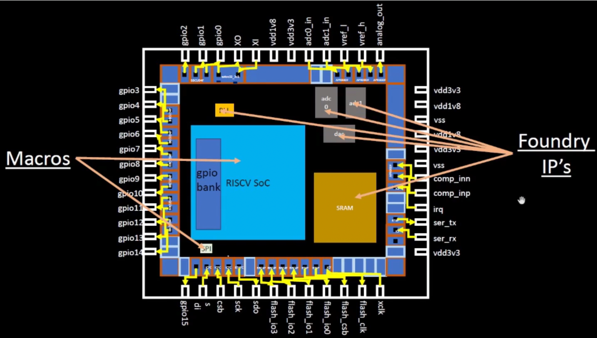

# 0- Introduction to QFN-48 Package, chip, pads, core, die and IPs

## Package

A integrated circuit consists of the Package and the Chip. The chip refers to the piece of silicon inside the casing, which connects the fragile silicon IO to the package IO to be interfaced with.


## Chip Components

Chips consist of Macros and Foundry IPs. Foundry IPs are specific logic optimized/developed for each foundry process (like ADCs and RAM), while Macros are digital


## Instruction Set Architecture

Instruction Set Architectures describe the instructions that is available to the CPU as a low level, these include Adding and Memory querying, etc. This is what machine code translates to when running on the CPU.

# 1- Introduction to RISC-V

## RISC-V: Reduced Instruction Set Computer V

RISC-V is a open source, reduced instruction set that is designed to be accessible and simple, contrasting licensed ISAs like x86, etc.

# 2-From Software Applications to Hardware

## Software flow

Languages, like C++, are compiled into assembly. The assembler then generates machine code, based on the ISA. The result is the executable is ISA dependent, as it was compiled for a specific architecture.


# 3- Introduction to all components of open-source digital asic design

## PDK Data

PDKs were once controlled tightly by companies who developed them.

Files that allows designers to design silicon:

- Process Design Rules
- Device Models
- Standard Cell Libraries
- IO Libraries

Most Prominent: Google Skywater 130nm, an FOSS PDK kit—first of its kind.

### 130nm?


Can go up to 1Ghz with pipelining, useful for entry level applications

Still has some market share:

# 4-Simplified RTL2GDS flow

RTL: Register transfer level code, digital model of a circuit, what you would get from Verilog.

(note: tools taken straight from openlane docs)

## Synthesis:

Converts RTL to a circuit (netlist) from components of the Standard Cell Library

yosys/abc - Perform RTL synthesis and technology mapping.

OpenSTA - Performs static timing analysis on the resulting netlist to generate timing reports

### Standard Cells

Components with regular, pre-defined layout, E.G. Invertors, NANDs, XORs

Each cell has man formats: Electrical, HDL, Spice, Abstracts/Detailed layouts

## Floorplan

Place the chip die, IO, pads, power rails, etc within the package. Does not place specific components.

init_fp - Defines the core area for the macro as well as the rows (used for placement) and the tracks (used for routing)

ioplacer - Places the macro input and output ports

pdngen - Generates the power distribution network

tapcell - Inserts welltap and decap cells in the floorplan


### Macro Floor-Planning

Describes overall chip dimensions, pin locations, and rows.

### Power Planning

Places power rails and rings onto the chip. Each chip usually has multiple power rails.


## Placement

Places the actual cells onto the rows in the floorplan.

RePLace - Performs global placement

Resizer - Performs optional optimizations on the design

OpenDP - Performs detailed placement to legalize the globally placed components


### Global

Groups related cells together, in one general area.

### Detailed

Actually place cells in each group together.

### Clock Tree Synthesis

The clock tree distributes the clock signals to all the cells. Ideally the clock tree should be symmetrical and short as possible to avoid mismatches (different signal timing) in clock tree.

TritonCTS - Synthesizes the clock distribution network (the clock tree)


## Route

Interconnects the metal layers together, respecting the PDK.

FastRoute - Performs global routing to generate a guide file for the detailed router

TritonRoute - Performs detailed routing

OpenRCX - Performs SPEF extraction


## Sign Off

### Physical Verification

#### Design Rules Checking (DRC)

Checks if the circuit can be manufactured by verifying the layout satisfies the Foundry's design rules.

#### Layout vs. Schematic (LVS)

Ensures the physical layout matches the digital schematic, comapres the GDSII to the verilog schematic.

### Timing Verification

#### Static Timing Analysis (STA)

Analyzes timing requirements of the circuit, to ensure that clock signals are delivered within the correct time window.

# 5-Introduction to OpenLANE and Strive chipsets

## Openlane

Openlane is a RTL to GDSII workflow that bundles several EDA tools, supporting sky130A.


### Design Structure

```
<design_name>
├── config.json/config.tcl
├── runs
│   ├── <tag>
│   │   ├── config.tcl
│   │   ├── {logs, reports, tmp}
│   │   │   ├── cts
│   │   │   ├── signoff
│   │   │   ├── floorplan
│   │   │   ├── placement
│   │   │   ├── routing
│   │   │   └── synthesis
│   │   ├── results
│   │   │   ├── final
│   │   │   ├── cts
│   │   │   ├── signoff
│   │   │   ├── floorplan
│   │   │   ├── placement
│   │   │   ├── routing
│   │   │   └── synthesis
```

### End Goal

Produce a GDSDII design without human intervention (i.e. an automated RTLGDSII workflow)

### Preconfigured designs

Many designs bundled with optimized flow configurations

### Workflows

Interactive: can tune flow parameters
Autonomous: automate flow based on the flow config file `flow.tcl`

## Strive SoC

Strive is a family of system on a chips (SoC) using the Sky130 arch.


# 6-Introduction to OpenLANE detailed ASIC design flow

## Synthesis Exploration

Determine the optimal synthesis strategy.

Generates a delay v. area report that shows how design v. area is affected by synthesis strategy.


## Design Exploration

`-synth_explore` generates a table with results that allows you to choose the best one out of them.


## Regression testing

Openlane can compare the results to the best known records to optimize your design.


## Design for Test (DFT)

Makes the synthesized design ready for testing.

### Scan Insertion

Replaces regular flip flops with scan flip flops that can be chained together.

### Automatic Test Pattern Generation

Generate inputs to detect faults:

- Stuck at faults (keeped latched states)
- Transition Faults
- Bridging Faults

### Test Patterns Compaction

Reduces the # of patterns to lower test time.

## Logic Equivalence Check

LEC confirms that whenever a netlist is modified, the circuit maintains logical equivalence with the schematic.

## Antenna Rule Violations

When a metal wire segment is long, it can act as an antenna. It can be resolved by adding a diode in line.


## Design Rule Checking

Checks against rules set by chip foundries, to ensure that a chip layout is manufacturable by the foundry, E.G. checking min distance between metals.

## Layout Versus Schematic

Compares GDSII to the verilog schematic to ensure that when the netlist changes, it follows the schematic.

- Shorts: Two or more wires that should not be connected have been and must be separated. The most problematic is power and ground shorts.

- Opens: Wires or components that should be connected are left dangling or only partially connected. These must be connected properly.

- Missing Components: An expected component has been left out of the layout.

- (from openlane docs)

## Static Timing Analysis

Calculates the time it takes for the clock signals/data to travel and arrive at the many standard cells. Ensures it is within a set range of acceptable latencies.
