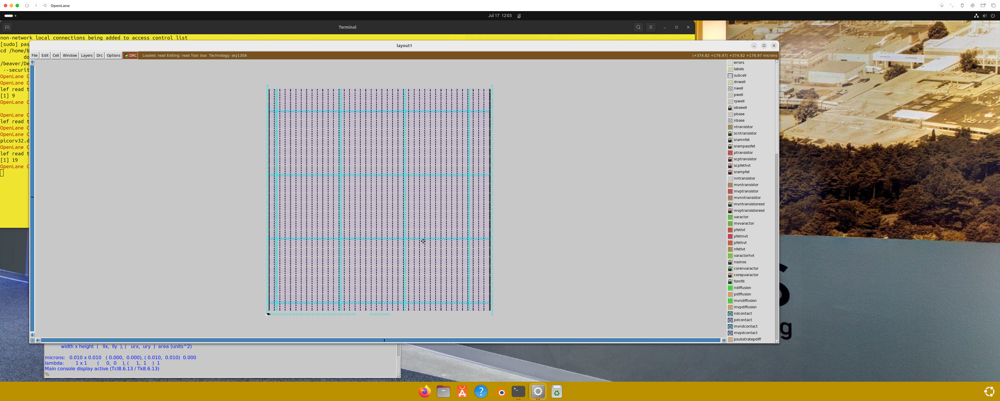

# 17 - Steps to Run Floorplan Using OpenLANE

## Overview

This section demonstrates how to run the floorplan step in the OpenLANE flow after synthesis has been completed.

## Step-by-Step Process

### 1. Launch OpenLANE Interactive Mode

```bash
OpenLane Container:/home/beaver/Desktop/work/tools/openlane_working_dir/openlane% ./flow.tcl -interactive
```

### 2. Initialize OpenLANE Environment

```bash
OpenLane e0d2e618a8834e733d28dfcc02fa166941be7e71
All rights reserved. (c) 2020-2023 Efabless Corporation and contributors.
Available under the Apache License, version 2.0. See the LICENSE file for more details.

% package require openlane
0.9
```

### 3. Prepare Design Configuration

```bash
% prep -design designs/ci/picorv32a
[INFO]: Using configuration in 'designs/ci/picorv32a/config.json'...
[INFO]: PDK Root: /root/.volare
[INFO]: Process Design Kit: sky130A
[INFO]: Standard Cell Library: sky130_fd_sc_hd
[INFO]: Optimization Standard Cell Library: sky130_fd_sc_hd
[INFO]: Run Directory: /home/beaver/Desktop/work/tools/openlane_working_dir/openlane/designs/ci/picorv32a/runs/RUN_2025.07.17_18.54.58
[INFO]: Saving runtime environment...
[INFO]: Preparing LEF files for the nom corner...
[INFO]: Preparing LEF files for the min corner...
[INFO]: Preparing LEF files for the max corner...
[WARNING]: PNR_SDC_FILE is not set. It is recommended to write a custom SDC file for the design. Defaulting to BASE_SDC_FILE
[WARNING]: SIGNOFF_SDC_FILE is not set. It is recommended to write a custom SDC file for the design. Defaulting to BASE_SDC_FILE
```

### 4. Run Synthesis (if not already done)

```bash
% run_synthesis
[STEP 1]
[INFO]: Running Synthesis (log: designs/ci/picorv32a/runs/RUN_2025.07.17_18.54.58/logs/synthesis/1-synthesis.log)...
[STEP 2]
[INFO]: Running Single-Corner Static Timing Analysis (log: designs/ci/picorv32a/runs/RUN_2025.07.17_18.54.58/logs/synthesis/2-sta.log)...
```

### 5. Execute Floorplan

```bash
% run_floorplan
[STEP 3]
[INFO]: Running Initial Floorplanning (log: designs/ci/picorv32a/runs/RUN_2025.07.17_18.54.58/logs/floorplan/3-initial_fp.log)...
[INFO]: Floorplanned with width 530.84 and height 530.4.
[STEP 4]
[INFO]: Running IO Placement (log: designs/ci/picorv32a/runs/RUN_2025.07.17_18.54.58/logs/floorplan/4-io.log)...
[STEP 5]
[INFO]: Running Tap/Decap Insertion (log: designs/ci/picorv32a/runs/RUN_2025.07.17_18.54.58/logs/floorplan/5-tap.log)...
[INFO]: Power planning with power {VPWR} and ground {VGND}...
[STEP 6]
[INFO]: Generating PDN (log: designs/ci/picorv32a/runs/RUN_2025.07.17_18.54.58/logs/floorplan/6-pdn.log)...
%
```

## Floorplan Steps Explained

- **Step 3**: Creates initial floorplan with core dimensions
- **Step 4**: Places IO pins around the chip perimeter
- **Step 5**: Inserts tap cells and decoupling capacitors
- **Step 6**: Generates Power Distribution Network (PDN)

# 18 - Review Floorplan Files and Steps to View Floorplan

## Checking Floorplan Results

### View Die Area Information

To check the die area dimensions from the generated DEF file:

```bash
beaver@openlanevm:~/Desktop/work/tools/openlane_working_dir/openlane/designs/ci/picorv32a/runs/RUN_2025.07.17_18.54.58$ cat results/floorplan/picorv32.def | grep "AREA"
DIEAREA ( 0 0 ) ( 542325 553045 ) ;
```

### Understanding the Output

- The DIEAREA coordinates show the chip dimensions in database units
- Format: `(x1 y1) (x2 y2)` where (x1,y1) is bottom-left and (x2,y2) is top-right corner
- Area = (542325 - 0) × (553045 - 0) = 542325 × 553045 database units

# 19 - Review Floorplan Layout in Magic

## Launching Magic Layout Viewer

### Command to Open Floorplan in Magic

```bash
OpenLane Container:/home/beaver/Desktop/work/tools/openlane_working_dir/openlane/designs/ci/picorv32a/runs/RUN_2025.07.17_18.54.58% magic -T /home/beaver/Desktop/work/tools/openlane_working_dir/pdks/sky130A/libs.tech/magic/sky130A.tech lef read tmp/merged.nom.lef def read results/floorplan/picorv32.def &
```

### Command Breakdown

- `-T`: Specifies the technology file for SKY130 PDK
- `lef read`: Loads the Library Exchange Format file containing cell abstracts
- `def read`: Loads the Design Exchange Format file containing the floorplan
- `&`: Runs the command in background



## Magic Navigation Commands

### Basic Navigation

- **`S`**: Select the topmost layer or object under cursor
- **`V`**: Center and fit the view to show selected objects
- **`Z`**: Zoom in on selected area
- **Mouse scroll**: Zoom in/out
- **Arrow keys**: Pan the view

### Viewing Individual Cells

Using `S` to select the topmost layer, then `V` to center, and `Z` to zoom in, we can see each individual cell:


### Examining Unplaced Cells

Scrolling to the bottom left, we can see the unarranged cells (standard cells that haven't been placed yet):


## Key Observations

- **Placed Elements**: IO pins, power rails, tap cells, and decaps are positioned
- **Unplaced Elements**: Standard cells remain in a collection area
- **Core Area**: Defined region where standard cells will be placed during placement step

# 24 - Congestion Aware Placement Using RePlAce

## Overview

This section demonstrates running the placement step after floorplan completion using OpenLANE's placement algorithms.

## Prerequisites

- Floorplan must be completed successfully
- OpenLANE environment should be active

## Placement Process

### 1. Initialize OpenLANE Session

```bash
OpenLane Container:/home/beaver/Desktop/work/tools/openlane_working_dir/openlane% ./flow.tcl -interactive
OpenLane e0d2e618a8834e733d28dfcc02fa166941be7e71
All rights reserved. (c) 2020-2023 Efabless Corporation and contributors.
Available under the Apache License, version 2.0. See the LICENSE file for more details.

% package require openlane
0.9
```

### 2. Prepare Design

```bash
% prep -design designs/ci/picorv32a
[INFO]: Using configuration in 'designs/ci/picorv32a/config.json'...
[INFO]: PDK Root: /root/.volare
[INFO]: Process Design Kit: sky130A
[INFO]: Standard Cell Library: sky130_fd_sc_hd
[INFO]: Optimization Standard Cell Library: sky130_fd_sc_hd
[INFO]: Run Directory: /home/beaver/Desktop/work/tools/openlane_working_dir/openlane/designs/ci/picorv32a/runs/RUN_2025.07.17_19.18.52
[INFO]: Saving runtime environment...
[INFO]: Preparing LEF files for the nom corner...
[INFO]: Preparing LEF files for the min corner...
[INFO]: Preparing LEF files for the max corner...
[WARNING]: PNR_SDC_FILE is not set. It is recommended to write a custom SDC file for the design. Defaulting to BASE_SDC_FILE
[WARNING]: SIGNOFF_SDC_FILE is not set. It is recommended to write a custom SDC file for the design. Defaulting to BASE_SDC_FILE
```

### 3. Run Prerequisites (Synthesis and Floorplan)

```bash
% run_synthesis
[STEP 1]
[INFO]: Running Synthesis (log: designs/ci/picorv32a/runs/RUN_2025.07.17_19.18.52/logs/synthesis/1-synthesis.log)...
[STEP 2]
[INFO]: Running Single-Corner Static Timing Analysis (log: designs/ci/picorv32a/runs/RUN_2025.07.17_19.18.52/logs/synthesis/2-sta.log)...

% run_floorplan
[STEP 3]
[INFO]: Running Initial Floorplanning (log: designs/ci/picorv32a/runs/RUN_2025.07.17_19.18.52/logs/floorplan/3-initial_fp.log)...
[INFO]: Floorplanned with width 530.84 and height 530.4.
[STEP 4]
[INFO]: Running IO Placement (log: designs/ci/picorv32a/runs/RUN_2025.07.17_19.18.52/logs/floorplan/4-io.log)...
[STEP 5]
[INFO]: Running Tap/Decap Insertion (log: designs/ci/picorv32a/runs/RUN_2025.07.17_19.18.52/logs/floorplan/5-tap.log)...
[INFO]: Power planning with power {VPWR} and ground {VGND}...
[STEP 6]
[INFO]: Generating PDN (log: designs/ci/picorv32a/runs/RUN_2025.07.17_19.18.52/logs/floorplan/6-pdn.log)...
```

### 4. Execute Placement

```bash
% run_placement
[STEP 7]
[INFO]: Running Global Placement (skip_io) (log: designs/ci/picorv32a/runs/RUN_2025.07.17_19.18.52/logs/placement/6-global_skip_io.log)...
[STEP 8]
[INFO]: Running Single-Corner Static Timing Analysis (log: designs/ci/picorv32a/runs/RUN_2025.07.17_19.18.52/logs/placement/8-gpl_sta.log)...
[STEP 9]
[INFO]: Running IO Placement (log: designs/ci/picorv32a/runs/RUN_2025.07.17_19.18.52/logs/placement/9-io.log)...
[STEP 10]
[INFO]: Running Global Placement (log: designs/ci/picorv32a/runs/RUN_2025.07.17_19.18.52/logs/placement/9-global.log)...
[STEP 11]
[INFO]: Running Single-Corner Static Timing Analysis (log: designs/ci/picorv32a/runs/RUN_2025.07.17_19.18.52/logs/placement/11-gpl_sta.log)...
[STEP 12]
[INFO]: Running Placement Resizer Design Optimizations (log: designs/ci/picorv32a/runs/RUN_2025.07.17_19.18.52/logs/placement/12-resizer.log)...
[STEP 13]
[INFO]: Running Detailed Placement (log: designs/ci/picorv32a/runs/RUN_2025.07.17_19.18.52/logs/placement/13-detailed.log)...
[STEP 14]
[INFO]: Running Single-Corner Static Timing Analysis (log: designs/ci/picorv32a/runs/RUN_2025.07.17_19.18.52/logs/placement/14-dpl_sta.log)...
%
```

## Placement Steps Explained

- **Step 7**: Global placement (skip IO) - Initial coarse placement of cells
- **Step 8**: Static Timing Analysis after global placement
- **Step 9**: IO placement refinement
- **Step 10**: Global placement refinement with all elements
- **Step 11**: Static Timing Analysis after global placement
- **Step 12**: Placement resizer optimizations for timing closure
- **Step 13**: Detailed placement - Final precise cell positioning
- **Step 14**: Final Static Timing Analysis after detailed placement

## Viewing Placement Results in Magic

### Command to Load Placement in Magic

```bash
OpenLane Container:/home/beaver/Desktop/work/tools/openlane_working_dir/openlane/designs/ci/picorv32a/runs/RUN_2025.07.17_19.18.52% magic -T /home/beaver/Desktop/work/tools/openlane_working_dir/pdks/sky130A/libs.tech/magic/sky130A.tech lef read tmp/merged.nom.lef def read results/placement/picorv32.def &
[1] 11
```

### Key Differences from Floorplan

- **File Location**: `results/placement/picorv32.def` instead of `results/floorplan/picorv32.def`
- **Cell Positioning**: Standard cells are now placed in organized rows within the core area
- **Optimization**: Cells are positioned to minimize wirelength and congestion


## Expected Results

- All standard cells should now be placed in legal positions within the core area
- Cells are arranged in rows with proper spacing
- No cells should remain in the unplaced collection area
- The layout shows organized placement with consideration for routing congestion
