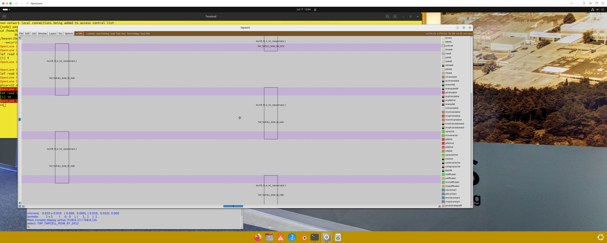

# 17-Steps to run floorplan using OpenLANE

After running synthesis in the flow environment, run floorplan:

```bash
OpenLane Container:/home/beaver/Desktop/work/tools/openlane_working_dir/openlane% ./flow.tcl -interactive
OpenLane e0d2e618a8834e733d28dfcc02fa166941be7e71
All rights reserved. (c) 2020-2023 Efabless Corporation and contributors.
Available under the Apache License, version 2.0. See the LICENSE file for more details.

% package require openlane
0.9
% prep -design designs/ci/picorv32a
[INFO]: Using configuration in 'designs/ci/picorv32a/config.json'...
[INFO]: PDK Root: /root/.volare
[INFO]: Process Design Kit: sky130A
[INFO]: Standard Cell Library: sky130_fd_sc_hd
[INFO]: Optimization Standard Cell Library: sky130_fd_sc_hd
[INFO]: Run Directory: /home/beaver/Desktop/work/tools/openlane_working_dir/openlane/designs/ci/picorv32a/runs/RUN_2025.07.17_18.54.58
[INFO]: Saving runtime environment...
[INFO]: Preparing LEF files for the nom corner...
[INFO]: Preparing LEF files for the min corner...
[INFO]: Preparing LEF files for the max corner...
[WARNING]: PNR_SDC_FILE is not set. It is recommended to write a custom SDC file for the design. Defaulting to BASE_SDC_FILE
[WARNING]: SIGNOFF_SDC_FILE is not set. It is recommended to write a custom SDC file for the design. Defaulting to BASE_SDC_FILE
% run_synthesis
[STEP 1]
[INFO]: Running Synthesis (log: designs/ci/picorv32a/runs/RUN_2025.07.17_18.54.58/logs/synthesis/1-synthesis.log)...
[STEP 2]
[INFO]: Running Single-Corner Static Timing Analysis (log: designs/ci/picorv32a/runs/RUN_2025.07.17_18.54.58/logs/synthesis/2-sta.log)...
% run_floorplan
[STEP 3]
[INFO]: Running Initial Floorplanning (log: designs/ci/picorv32a/runs/RUN_2025.07.17_18.54.58/logs/floorplan/3-initial_fp.log)...
[INFO]: Floorplanned with width 530.84 and height 530.4.
[STEP 4]
[INFO]: Running IO Placement (log: designs/ci/picorv32a/runs/RUN_2025.07.17_18.54.58/logs/floorplan/4-io.log)...
[STEP 5]
[INFO]: Running Tap/Decap Insertion (log: designs/ci/picorv32a/runs/RUN_2025.07.17_18.54.58/logs/floorplan/5-tap.log)...
[INFO]: Power planning with power {VPWR} and ground {VGND}...
[STEP 6]
[INFO]: Generating PDN (log: designs/ci/picorv32a/runs/RUN_2025.07.17_18.54.58/logs/floorplan/6-pdn.log)...
%
```

# 18-Review floorplan files and steps to view floorplan

We can view the floorplan with:

```bash
beaver@openlanevm:~/Desktop/work/tools/openlane_working_dir/openlane/designs/ci/picorv32a/runs/RUN_2025.07.17_18.54.58$ cat results/floorplan/picorv32.def | grep "AREA"
DIEAREA ( 0 0 ) ( 542325 553045 ) ;
```

# 19-Review floorplan layout in Magic

We can launch the floorplan in magic:

```bash
OpenLane Container:/home/beaver/Desktop/work/tools/openlane_working_dir/openlane/designs/ci/picorv32a/runs/RUN_2025.07.17_18.54.58% magic -T /home/beaver/Desktop/work/tools/openlane_working_dir/pdks/sky130A/libs.tech/magic/sky130A.tech lef read tmp/merged.nom.lef def read results/floorplan/picorv32.def &
```


Using `S` to select the topmost layer, then `V` to center, and `Z` to zoom in, we can see each individual cell:


Scrolling to the bottom left, we can see the unarranged cells.


# 24-Congestion aware placement using RePlAce

Run placement in the openlane Flow ENV:

```bash
OpenLane Container:/home/beaver/Desktop/work/tools/openlane_working_dir/openlane% ./flow.tcl -interactive
OpenLane e0d2e618a8834e733d28dfcc02fa166941be7e71
All rights reserved. (c) 2020-2023 Efabless Corporation and contributors.
Available under the Apache License, version 2.0. See the LICENSE file for more details.

% package require openlane
0.9
% prep -design designs/ci/picorv32a
[INFO]: Using configuration in 'designs/ci/picorv32a/config.json'...
[INFO]: PDK Root: /root/.volare
[INFO]: Process Design Kit: sky130A
[INFO]: Standard Cell Library: sky130_fd_sc_hd
[INFO]: Optimization Standard Cell Library: sky130_fd_sc_hd
[INFO]: Run Directory: /home/beaver/Desktop/work/tools/openlane_working_dir/openlane/designs/ci/picorv32a/runs/RUN_2025.07.17_19.18.52
[INFO]: Saving runtime environment...
[INFO]: Preparing LEF files for the nom corner...
[INFO]: Preparing LEF files for the min corner...
[INFO]: Preparing LEF files for the max corner...
run[WARNING]: PNR_SDC_FILE is not set. It is recommended to write a custom SDC file for the design. Defaulting to BASE_SDC_FILE
[WARNING]: SIGNOFF_SDC_FILE is not set. It is recommended to write a custom SDC file for the design. Defaulting to BASE_SDC_FILE
% _synthesis
[STEP 1]
[INFO]: Running Synthesis (log: designs/ci/picorv32a/runs/RUN_2025.07.17_19.18.52/logs/synthesis/1-synthesis.log)...
run_floorplan[STEP 2]
[INFO]: Running Single-Corner Static Timing Analysis (log: designs/ci/picorv32a/runs/RUN_2025.07.17_19.18.52/logs/synthesis/2-sta.log)...
%
[STEP 3]
[INFO]: Running Initial Floorplanning (log: designs/ci/picorv32a/runs/RUN_2025.07.17_19.18.52/logs/floorplan/3-initial_fp.log)...
[INFO]: Floorplanned with width 530.84 and height 530.4.
[STEP 4]
[INFO]: Running IO Placement (log: designs/ci/picorv32a/runs/RUN_2025.07.17_19.18.52/logs/floorplan/4-io.log)...
ru[STEP 5]
n[INFO]: Running Tap/Decap Insertion (log: designs/ci/picorv32a/runs/RUN_2025.07.17_19.18.52/logs/floorplan/5-tap.log)...
_[INFO]: Power planning with power {VPWR} and ground {VGND}...
[STEP 6]
[INFO]: Generating PDN (log: designs/ci/picorv32a/runs/RUN_2025.07.17_19.18.52/logs/floorplan/6-pdn.log)...
% placement
[STEP 7]
[INFO]: Running Global Placement (skip_io) (log: designs/ci/picorv32a/runs/RUN_2025.07.17_19.18.52/logs/placement/6-global_skip_io.log)...
[STEP 8]
[INFO]: Running Single-Corner Static Timing Analysis (log: designs/ci/picorv32a/runs/RUN_2025.07.17_19.18.52/logs/placement/8-gpl_sta.log)...
[STEP 9]
[INFO]: Running IO Placement (log: designs/ci/picorv32a/runs/RUN_2025.07.17_19.18.52/logs/placement/9-io.log)...
[STEP 10]
[INFO]: Running Global Placement (log: designs/ci/picorv32a/runs/RUN_2025.07.17_19.18.52/logs/placement/9-global.log)...
[STEP 11]
[INFO]: Running Single-Corner Static Timing Analysis (log: designs/ci/picorv32a/runs/RUN_2025.07.17_19.18.52/logs/placement/11-gpl_sta.log)...
[STEP 12]
[INFO]: Running Placement Resizer Design Optimizations (log: designs/ci/picorv32a/runs/RUN_2025.07.17_19.18.52/logs/placement/12-resizer.log)...
[STEP 13]
[INFO]: Running Detailed Placement (log: designs/ci/picorv32a/runs/RUN_2025.07.17_19.18.52/logs/placement/13-detailed.log)...
[STEP 14]
[INFO]: Running Single-Corner Static Timing Analysis (log: designs/ci/picorv32a/runs/RUN_2025.07.17_19.18.52/logs/placement/14-dpl_sta.log)...
%
```

Then, we can load the newly merged `.lef` and placement `def` into `Magic`:

```bash
OpenLane Container:/home/beaver/Desktop/work/tools/openlane_working_dir/openlane/designs/ci/picorv32a/runs/RUN_2025.07.17_19.18.52% magic -T /home/beaver/Desktop/work/tools/openlane_working_dir/pdks/sky130A/libs.tech/magic/sky130A.tech lef read tmp/merged.nom.lef def read results/placement/picorv32.def &
[1] 11
```


