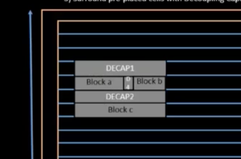

# Utilization Factor and Aspect Ratio

Standard cells may not occupy the entirety of a chip footprint. The % of chip that contains standard cells->1 unit NAND/Gates/etc is 1 sq. units of the silicon wafer.

Aspect ratio is the length vs width of the chip size.

# 13- Concept of pre-placed cells

Pre placed cells are logic modules that are portable and can be reused in many places. Their locations within the silicon is fixed due to constraints like power distribution, routing optimization, etc.

These cells can be further abstracted through black boxing, in which only their IO is exposed to the circuit designer, to protect foundry IP or simplify the simulation process.

# 14- De-coupling capacitors

Decoupling capacitors are placed next to the pre-placed cells, to avoid voltage drop across a wire to preserve power signal.

# 15-Power Planning

## Ground bounce

When a lot of capacitors discharge at once, ground bounce can occur. This in turn can trigger voltage drops due to not enough current to charge all the capacitors that are discharging. This issue can be avoided by having multiple power sources/rails to create a capacitor charging networks.

# 16-Pin placement and logical cell placement blockage

We place the pins on the left and right of the core.
Then, blockers are placed to avoid autoplacement of cells onto the pins:

# 20-Netlist binding and initial place design

Netlist binding means merging the netlist, the abstraction of logic connectivity with physical cells.

Placement physically places the blocks from the library onto the rows of the chip.

# 21- Optimize placement using estimated wire-length and capacitance

Simulations tell us the optimal wirelength for connecting modules. Repeaters can be added in line to maintain consistent signalling along the wire.

# 22-Final placement optimization

# 25-Inputs for cell design flow

## Standard Cells

Standard cells are predefined modules like NAND, XOR, AND gates etc.

They can come in multiple sizes with different drive strengths which have different voltage thresholds:

## Cell Design FLow

### Inputs

Process design kits—allows designers to see what technologies are available/their physical sizes.

DRC/LVS rules check manufacturability

SPICE models help simulate cell performance

library/user defined specs such as clock speed, area budget, power constraints, IO, metal layers, etc

# 26-Circuit design step

# 27-Layout design step

# 28-Typical characterization flow

# 29-Timing threshold definitions

# 30-Propagation delay and transition time
