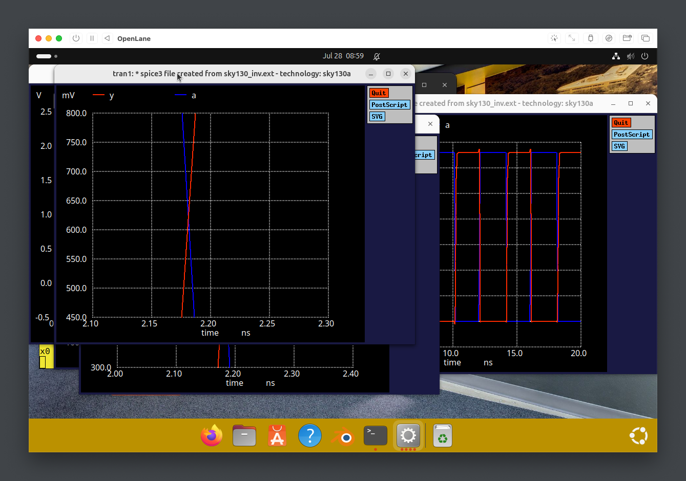

# Labs for CMOS Inverter NGSPICE Simulations

## IO Placer

By default, Openlane uses equidistant pin placement. To change it to clustered pin strategy, run `set ::env(FP_IO_MODE) 2`, then run `run_floorplan` again.


## Spice Deck Creation

### Structure of a SPICE Deck:

Title Line: The first line is always a title or comment (e.g. \* CMOS Inverter Simulation).

.INCLUDE Statement: Includes external files containing model parameters. For this lab, it's crucial to include the SKY130 model files: .include /path/to/sky130.lib.spice.

### Component Instantiation:

PMOS: `M1 Y A VPWR VPWR pmos_model W=0.375u L=0.25u`

- M1: Name of the device

- Y A VPWR VPWR: Node connections for Drain, Gate, Source, and Substrate

- pmos_model: Name of the model defined in the included library file

- W, L: Transistor width and length

NMOS: M0 Y A VGND VGND nmos_model W=0.375u L=0.25u
Voltage Sources:

Power (Vdd): V_VPWR VPWR 0 DC 3.3V (A DC source of 3.3V between node VPWR and ground 0).

Ground (Vss): V_VGND VGND 0 DC 0V

Input (Vin): V_A A 0 PULSE(0 3.3 0 0.1n 0.1n 2n 4n)

PULSE Parameters: V_initial V_final T_delay T_rise T_fall T_on Period—creates a repeating pulse waveform.

Load Capacitor: C_load Y 0 2f (A 2 femtofarad load capacitor on the output node Y).

Analysis Command: .tran 1p 10n (Perform a transient analysis for 10 nanoseconds with a 1 picosecond step).

.END Statement: Marks the end of the deck.


## Switching Threshold Vm

Vm is the point on the VTC where Vin = Vout. It is a measure of the inverter's switching point and its noise margins.

`V_A A 0 DC 0`
The input source is changed from a PULSE to a DC source `.dc V_A 0 3.3 0.01`—sweeps the voltage source V_A from 0V to 3.3V in 0.01V steps

### Impact of Transistor Sizing:

- symmetric (Wp = Wn): Vm is lower than VDD/2 (~0.9V for a 3.3V supply) because the NMOS is stronger

- PMOS-Skewed (Wp > Wn): By increasing the PMOS width, Vm is shifted closer to the ideal VDD/2, resulting in more symmetric noise margins

## Static and Dynamic Simulation of CMOS Inverter

### Static Simulation (DC Analysis)

analyze the circuit's behavior when inputs are stable to determine DC characteristics

Metrics:

- switching Threshold (Vm)
- Noise Margin High (NMH)
- Noise Margin Low (NML), and leakage currents.

sweeps a DC input voltage and plotting the DC output voltage (.dc)

### Dynamic Simulation (Transient Analysis)

analyze the circuit's behavior over time as inputs change to determine timing and power characteristics

Metrics:

- Propagation Delay (tpd): Time from 50% of input transition to 50% of output transition. There are two types: tpd_rise and tpd_fall

- Transition Time (slew): Time for the output to transition between 20% and 80% (or 10% and 90%) of its final value. There are two types: t_rise and t_fall

applyys a time-varying input (like a PULSE) and plotting the output waveform over time (.tran)

## Opening the inverter design:

```bash
cd Desktop/work/tools/openlane_working_dir/openlane


git clone https://github.com/nickson-jose/vsdstdcelldesign

cd vsdstdcelldesign

magic -T sky130A.tech sky130_inv.mag &
```


Use the `what` command int he console to identify cell types:


## CMOS Fabrication

1. Substrate Preparation

   a. Starting Material: A lightly doped P-type silicon wafer is used as the base substrate

   b. Properties

   1. High resistivity is chosen to reduce substrate noise coupling

   2. A low doping level (10^15 atoms/cm^3) is used, which is less than the doping of the wells that will be created later

   3. Crystal Orientation: Typically <100> orientation is used for its favorable electronic properties

2. Create Active Regions

   a. The LOCOS (Local Oxidation of Silicon) process is used to create thick oxide regions for isolation.

   b. Process Steps

   1. A layer of stress relief SiO2 is grown over the entire wafer.

   2. A layer of silicon nitride is deposited, this acts like a mask preventing oxygen from reaching silicon underneath.

   3. Mask 1

      a. A layer of photoresist is spun onto the waver

      b. Resist is exposed to UV light that defines the active areas 

      c. The exposed resist is developed away

   4. Etch

      a. Si3N4 is etched away from the areas not protected by the photoresist, epxosing the pad in the filed regions

   5. Field Oxide Growth

      a. A thick layer of SiO2 grows in the exposed field regions, preventing oxidation in the active areas

   6. Strip
      a. Si3N$ mask is chemicaly removed, leaving "islands" of active silicon surrounded by thick field oxide for isolation.
      

3. Formation of N/P Well

   a. P well Formation (Mask 2)

   1. New layer of photoresist is applied
   2. Mask is used to expose only the area where P-wells are desired
   3. Wafer is subjected to ion implantation, in which P-type depoant ions are accelerated and shot into the silicon, blocking ions from reaching hte N-well regions.
      

   b. N-well Formation (Mask 3)

   1. First resist layer is stripped
   2. New layer and mask is used, proteting the P-well regions this time.
   3. Wafer is implanted with N-type dopant to form N-wells

   c. Well Drive-in

   1. The wafer undergoes a high temperature annealing process that drives int he dopants to the desired depth and activates them electrically by incorporating them into the crystal lattice structure 

4. Formation of Gate Terminal

   a. Gate Oxide Growth

   1. The pad oxide is stripped from the active areas, leaving a thin laye rof silicon dioxide grown known as the gate oxide, its thickness determines transistor properties

5. Lightly Doped Drain Formation

   a. The high electric field near the drain can accelerate electrons to very high energies are injected into the gate oxide, degrading hte transistor over time. The LDD creates a more lightly doped region near hte draint o reduce the peak electric field

6. Source and Drain Formation

   a. A layer of insulator is deposited over the entire wafer, then etched away (known as sidewall spacers)

   b. Mask7/8: N/P+ implants are placed to protect the PMOS regions.

   c. Annealing integrates the dopants into the silicon

7. Local Interconnect Formation

   a. Metal Deposition, such as Ti, Co, is deposited over the entire wafer surface.

   b. Annealing: The wafer is heated. The metal reacts with any exposed silicon to form a silicide

   c. A chemical etch is used to remove the unreacted metal from the oxide surfaces

8. High Level Metal Formation

   a. Surface is made flat using Chemical Mechanical Polishing

   b. Contact holes are filled with a metal, typically Tungsten

   c. Mask 10/Metal 1, first layer of interconnect metal is deposited and then patterned with etching

   d. The process repeats for each additional layer of metal.

## SKY130 Tech File Lab

Use ext2spice and extractall to extract and generate a spice simulation file from the magic design.

Modify the .spice file to add simulation harnesses


Run the command: `ngspice sky130_inv.spice`. This launches NGSPICE and loads the simulation file.


auto executes run: Executes the analysis defined in the SPICE deck (the .tran command).

`plot v(Y) v(A)` (or alt. `plot y vs time a`): Plots the voltage at the output node Y and the input node A against time.


We can calculate propagation delays, rising/fall delay from the plotted graphs.



0.66, 20% Voltage
2.64, 80% Voltage


`0.0648ns` rising time

## Fix DRC

Open up problematic DRC


Use `S` to select the poly


Modify DRC in .tech file


Notice DRC Error

