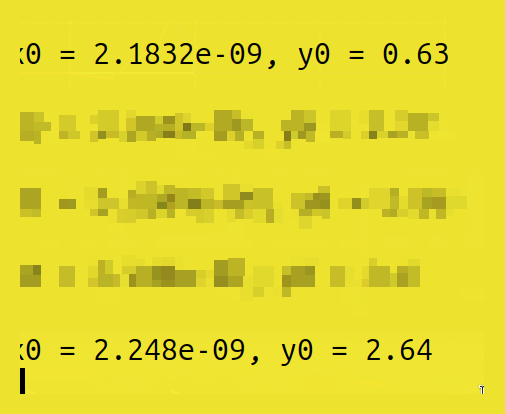

## Labs for CMOS Inverter NGSPICE Simulations

## IO Placer

By default, Openlane uses equidistant pin placement. To change it to clustered pin strategy, run `set ::env(FP_IO_MODE) 2`, then run `run_floorplan` again.


### Pin Placement Strategies

- `Equidistant Placement (Default)`: Pins are evenly spaced around the chip perimeter
- `Clustered Placement`: Related pins are grouped together for better routing
- `Custom Placement`: Manual pin positioning for specific design requirements
- `Automatic Optimization`: Tool-driven placement based on connectivity analysis

### IO Placer Configuration Options

- `FP_IO_MODE = 1`: Default equidistant pin placement mode
- `FP_IO_MODE = 2`: Clustered pin placement for related signals
- `IO_LAYERS`: Specify which metal layers to use for IO pins
- `FP_IO_VMETAL`: Vertical metal layer for IO routing
- `FP_IO_HMETAL`: Horizontal metal layer for IO routing

### Impact on Design Performance

- `Routing Congestion`: Pin placement affects overall routing difficulty
- `Signal Integrity`: Grouped pins can reduce crosstalk and noise
- `Package Integration`: Pin arrangement must match package specifications
- `Power Distribution`: IO placement affects power grid design
- `Timing Closure`: Pin locations impact IO timing requirements

## Spice Deck Creation

### Structure of a SPICE Deck:

`Essential Components of SPICE Netlist:`

- `Title Line`: The first line is always a title or comment (e.g. \* CMOS Inverter Simulation).
- `Model Inclusion`: .INCLUDE Statement: Includes external files containing model parameters. For this lab, it's crucial to include the SKY130 model files: .include /path/to/sky130.lib.spice.
- `Device Instantiation`: Define all circuit components with proper connectivity
- `Analysis Commands`: Specify simulation type and parameters
- `Control Statements`: Set simulation conditions and output formats

### Component Instantiation:

`MOSFET Device Syntax:`
PMOS: `M1 Y A VPWR VPWR pmos_model W=0.375u L=0.25u`

- `M1`: Name of the device (must start with M for MOSFETs)
- `Y A VPWR VPWR`: Node connections for Drain, Gate, Source, and Substrate
- `pmos_model`: Name of the model defined in the included library file
- `W, L`: Transistor width and length (critical for device characteristics)

`NMOS Configuration:`
NMOS: M0 Y A VGND VGND nmos_model W=0.375u L=0.25u

### Voltage Source Definitions:

`Power Supply Sources:`

- `Power (Vdd)`: V_VPWR VPWR 0 DC 3.3V (A DC source of 3.3V between node VPWR and ground 0).
- `Ground (Vss)`: V_VGND VGND 0 DC 0V
- `Input (Vin)`: V_A A 0 PULSE(0 3.3 0 0.1n 0.1n 2n 4n)

`PULSE Parameters Breakdown:`

- `V_initial`: Starting voltage level (0V)
- `V_final`: Final voltage level (3.3V)
- `T_delay`: Delay before pulse starts (0s)
- `T_rise`: Rise time from 10% to 90% (0.1ns)
- `T_fall`: Fall time from 90% to 10% (0.1ns)
- `T_on`: Pulse width at high level (2ns)
- `Period`: Complete cycle time (4ns)—creates a repeating pulse waveform.

### Additional Circuit Elements:

`Load Capacitor`: C_load Y 0 2f (A 2 femtofarad load capacitor on the output node Y).

- `Purpose`: Represents realistic load conditions
- `Impact`: Affects switching speed and power consumption
- `Typical Values`: Range from femtofarads to picofarads

`Analysis Command`: .tran 1p 10n (Perform a transient analysis for 10 nanoseconds with a 1 picosecond step).

- `Time Step`: Determines simulation accuracy vs. runtime trade-off
- `Duration`: Total simulation time window
- `Output`: Time-domain response of all circuit nodes

`.END Statement`: Marks the end of the deck.

- `Required`: SPICE parser needs explicit end marker
- `Validation`: Ensures complete netlist parsing


## Switching Threshold Vm

Vm is the point on the VTC where Vin = Vout. It is a measure of the inverter's switching point and its noise margins.

### Switching Threshold Characteristics

- `Definition`: Critical voltage where input equals output (Vin = Vout)
- `VTC Curve`: Voltage Transfer Characteristic shows inverter behavior
- `Noise Margin Impact`: Determines robustness against noise and variations
- `Design Target`: Ideally should be at VDD/2 for symmetric operation
- `Process Sensitivity`: Varies with manufacturing and environmental conditions

### DC Sweep Analysis Configuration

`V_A A 0 DC 0`
The input source is changed from a PULSE to a DC source `.dc V_A 0 3.3 0.01`—sweeps the voltage source V_A from 0V to 3.3V in 0.01V steps

### DC Analysis Parameters

- `Sweep Range`: Complete input voltage range (0V to VDD)
- `Step Size`: Determines resolution of VTC curve (0.01V provides smooth curve)
- `Measurement Points`: Extract Vm, VIL, VIH, VOL, VOH from curve
- `Derivative Analysis`: Find maximum slope point for noise margin calculation

### Impact of Transistor Sizing:

`Symmetric Design (Wp = Wn):`

- `Vm Shift`: Vm is lower than VDD/2 (~0.9V for a 3.3V supply) because the NMOS is stronger
- `Current Drive`: NMOS has higher mobility than PMOS at same size
- `Noise Margins`: Asymmetric NMH and NML values
- `Power Consumption`: Balanced switching currents

`PMOS-Skewed Design (Wp > Wn):`

- `Vm Correction`: By increasing the PMOS width, Vm is shifted closer to the ideal VDD/2, resulting in more symmetric noise margins
- `Drive Strength Matching`: Compensates for mobility difference between NMOS and PMOS
- `Area Trade-off`: Larger PMOS increases cell area but improves symmetry
- `Performance Impact`: May affect switching speed due to increased capacitance

### Design Considerations

- `Process Variations`: Vm shifts with process corners (SS, FF, SF, FS)
- `Temperature Effects`: Device characteristics change with temperature
- `Supply Voltage Scaling`: Vm relationship changes with different VDD levels
- `Threshold Voltage Impact`: VT variations directly affect switching point
- `Body Effect`: Substrate bias can influence threshold voltages

## Static and Dynamic Simulation of CMOS Inverter

### Static Simulation (DC Analysis)

`Purpose and Methodology:`
analyze the circuit's behavior when inputs are stable to determine DC characteristics

`Key Metrics Extracted:`

- `switching Threshold (Vm)`: Input voltage where output equals input
- `Noise Margin High (NMH)`: Immunity to high-level noise (VOH - VIH)
- `Noise Margin Low (NML)`: Immunity to low-level noise (VIL - VOL)
- `Leakage Currents`: Off-state current consumption

`Analysis Method:`
sweeps a DC input voltage and plotting the DC output voltage (.dc)

### Static Analysis Applications

- `Design Validation`: Verify logic levels meet specifications
- `Process Corner Analysis`: Check performance across manufacturing variations
- `Power Estimation`: Calculate static power consumption

### Dynamic Simulation (Transient Analysis)

`Purpose and Methodology:`
analyze the circuit's behavior over time as inputs change to determine timing and power characteristics

`Key Metrics Extracted:`

- `Propagation Delay (tpd)`: Time from 50% of input transition to 50% of output transition. There are two types: tpd_rise and tpd_fall
- `Transition Time (slew)`: Time for the output to transition between 20% and 80% (or 10% and 90%) of its final value. There are two types: t_rise and t_fall

`Analysis Method:`
applyys a time-varying input (like a PULSE) and plotting the output waveform over time (.tran)

### Dynamic Analysis Applications

- `Timing Characterization`: Extract delay and slew parameters for library
- `Power Analysis`: Calculate dynamic power from switching activity
- `Signal Integrity`: Check for overshoot, undershoot, and ringing
- `Load Sensitivity`: Analyze performance with different output loads
- `Temperature/Voltage Scaling`: Characterize across operating conditions

### Simulation Setup Considerations

- `Time Step Selection`: Balance accuracy with simulation runtime
- `Stimulus Design`: Create appropriate input waveforms for characterization
- `Load Modeling`: Include realistic capacitive and resistive loads
- `Process Corners`: Run simulations across all relevant process variations

## Opening the inverter design:

### Design File Access and Setup

```bash
cd Desktop/work/tools/openlane_working_dir/openlane

git clone https://github.com/nickson-jose/vsdstdcelldesign

cd vsdstdcelldesign

magic -T sky130A.tech sky130_inv.mag &
```

### Repository and File Structure

- `Technology File`: sky130A.tech provides process-specific design rules
- `Layout File`: sky130_inv.mag contains the physical design data


### Layout Analysis Commands

Use the `what` command int he console to identify cell types:


### Magic Console Commands

- `what`: Identifies the type and properties of selected objects
- `select`: Choose specific layout elements for analysis
- `box`: Define rectangular regions for operations
- `measure`: Calculate distances and areas
- `drc check`: Run design rule verification
- `extract`: Generate netlists from layout
- `plot`: Create visual outputs and reports

### Design Verification Process

- `Visual Inspection`: Check layout against design requirements
- `Layer Verification`: Ensure proper layer usage and connectivity
- `Rule Compliance`: Verify adherence to manufacturing constraints
- `Electrical Verification`: Confirm proper device operation
- `Parasitic Extraction`: Account for layout-dependent effects

## CMOS Fabrication

1. Substrate Preparation

   a. Starting Material: A lightly doped P-type silicon wafer is used as the base substrate

   b. Properties

   1. High resistivity is chosen to reduce substrate noise coupling

   2. A low doping level (10^15 atoms/cm^3) is used, which is less than the doping of the wells that will be created later

   3. Crystal Orientation: Typically <100> orientation is used for its favorable electronic properties

2. Create Active Regions

   a. The LOCOS (Local Oxidation of Silicon) process is used to create thick oxide regions for isolation.

   b. Process Steps

   1. A layer of stress relief SiO2 is grown over the entire wafer.

   2. A layer of silicon nitride is deposited, this acts like a mask preventing oxygen from reaching silicon underneath.

   3. Mask 1

      a. A layer of photoresist is spun onto the waver

      b. Resist is exposed to UV light that defines the active areas 

      c. The exposed resist is developed away

   4. Etch

      a. Si3N4 is etched away from the areas not protected by the photoresist, epxosing the pad in the filed regions

   5. Field Oxide Growth

      a. A thick layer of SiO2 grows in the exposed field regions, preventing oxidation in the active areas

   6. Strip
      a. Si3N$ mask is chemicaly removed, leaving "islands" of active silicon surrounded by thick field oxide for isolation.
      

3. Formation of N/P Well

   a. P well Formation (Mask 2)

   1. New layer of photoresist is applied
   2. Mask is used to expose only the area where P-wells are desired
   3. Wafer is subjected to ion implantation, in which P-type depoant ions are accelerated and shot into the silicon, blocking ions from reaching hte N-well regions.
      

   b. N-well Formation (Mask 3)

   1. First resist layer is stripped
   2. New layer and mask is used, proteting the P-well regions this time.
   3. Wafer is implanted with N-type dopant to form N-wells

   c. Well Drive-in

   1. The wafer undergoes a high temperature annealing process that drives int he dopants to the desired depth and activates them electrically by incorporating them into the crystal lattice structure 

4. Formation of Gate Terminal

   a. Gate Oxide Growth

   1. The pad oxide is stripped from the active areas, leaving a thin laye rof silicon dioxide grown known as the gate oxide, its thickness determines transistor properties

5. Lightly Doped Drain Formation

   a. The high electric field near the drain can accelerate electrons to very high energies are injected into the gate oxide, degrading hte transistor over time. The LDD creates a more lightly doped region near hte draint o reduce the peak electric field

6. Source and Drain Formation

   a. A layer of insulator is deposited over the entire wafer, then etched away (known as sidewall spacers)

   b. Mask7/8: N/P+ implants are placed to protect the PMOS regions.

   c. Annealing integrates the dopants into the silicon

7. Local Interconnect Formation

   a. Metal Deposition, such as Ti, Co, is deposited over the entire wafer surface.

   b. Annealing: The wafer is heated. The metal reacts with any exposed silicon to form a silicide

   c. A chemical etch is used to remove the unreacted metal from the oxide surfaces

8. High Level Metal Formation

   a. Surface is made flat using Chemical Mechanical Polishing

   b. Contact holes are filled with a metal, typically Tungsten

   c. Mask 10/Metal 1, first layer of interconnect metal is deposited and then patterned with etching

   d. The process repeats for each additional layer of metal.

## SKY130 Tech File Lab

### Extraction and Simulation Setup

Use ext2spice and extractall to extract and generate a spice simulation file from the magic design.

### Magic Extraction Commands

- `ext2spice`: Converts layout to SPICE netlist format
- `extractall`: Performs complete parasitic extraction
- `extract`: Base command for netlist generation

### Extraction Process Steps

- `Layout Verification`: Ensure DRC-clean layout before extraction
- `Parasitic Modeling`: Include capacitance and resistance effects
- `Device Recognition`: Identify transistors and passive components
- `Connectivity Analysis`: Verify proper electrical connections
- `Model Integration`: Link extracted devices to SPICE models

### Simulation File Preparation

Modify the .spice file to add simulation harnesses


### SPICE File Modifications

- `Power Supply Addition`: Add VDD and ground connections
- `Input Stimulus`: Define test vectors and signal sources
- `Output Loading`: Include realistic load capacitances
- `Analysis Commands`: Specify transient, DC, or AC analysis
- `Control Statements`: Set simulation parameters and options

### Simulation Execution

Run the command: `ngspice sky130_inv.spice`. This launches NGSPICE and loads the simulation file.


### NGSPICE Operation Flow

- `File Loading`: Reads and parses the SPICE netlist
- `Circuit Analysis`: Builds internal circuit representation
- `Operating Point`: Calculates initial DC conditions
- `Analysis Execution`: auto executes run: Executes the analysis defined in the SPICE deck (the .tran command).
- `Data Storage`: Maintains simulation results for plotting

### Waveform Analysis

`plot v(Y) v(A)` (or alt. `plot y vs time a`): Plots the voltage at the output node Y and the input node A against time.


### Performance Parameter Extraction

We can calculate propagation delays, rising/fall delay from the plotted graphs.


### Measurement Techniques

`Voltage Level Identification:`

- `0.66V`: 20% Voltage level for transition time measurement
- `2.64V`: 80% Voltage level for transition time measurement

`Timing Measurements:`

`0.0648ns` rising time

### Key Performance Metrics

- `Rise Time`: Time for output to transition from 20% to 80% of final value
- `Fall Time`: Time for output to transition from 80% to 20% of initial value
- `Propagation Delay`: Time from 50% input change to 50% output change
- `Setup/Hold Times`: Timing requirements for proper operation
- `Power Consumption`: Static and dynamic power analysis

### Characterization Applications

- `Library Generation`: Create timing and power models for synthesis
- `Design Validation`: Verify performance meets specifications
- `Process Optimization`: Identify areas for improvement
- `Variation Analysis`: Understand sensitivity to process changes
- `Reliability Assessment`: Evaluate long-term performance stability

## Fix DRC

Open up problematic design


### Magic DRC Tools

Use `S` to select the poly


### Interactive DRC Commands

- `drc check`: Run comprehensive design rule verification
- `drc why`: Explain specific DRC violation reasons
- `drc find`: Locate next DRC error in layout
- `select`: Choose objects for detailed analysis
- `S key`: Quick selection of objects under cursor

### Technology File Modification

Modify DRC in .tech file


### Tech File DRC Rules

- `Layer Definitions`: Specify physical layer properties
- `Spacing Rules`: Minimum distances between features
- `Width Rules`: Minimum and maximum feature sizes
- `Overlap Rules`: Required overlaps between layers
- `Density Rules`: Metal and via density requirements

### DRC Rule Categories

- `Geometric Rules`: Width, spacing, and enclosure requirements
- `Connectivity Rules`: Via and contact formation requirements
- `Matching Rules`: Symmetry and alignment requirements
- `Process Rules`: Manufacturing-specific constraints
- `Electrical Rules`: Current density and reliability limits

### Verification Results

Notice DRC Error

