## Convert Grid Information Into Track Information

### Current Track Information & Grid Configuration

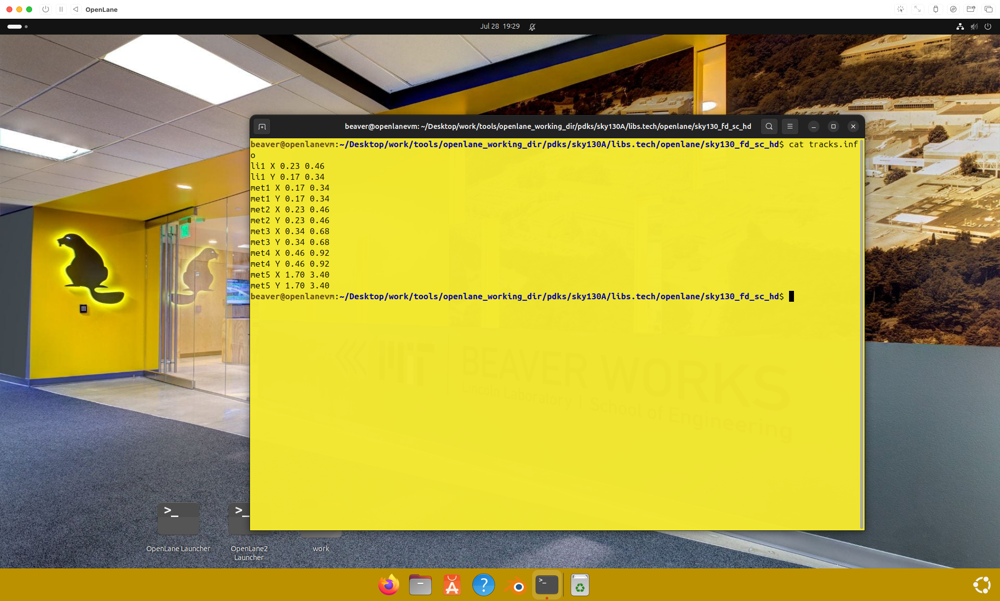

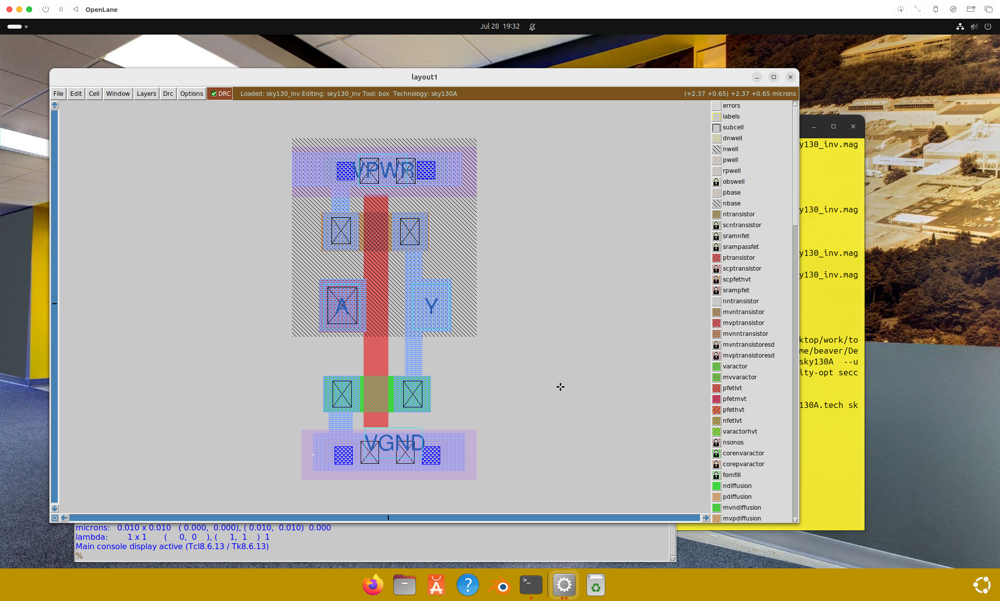

Track information is crucial for routing and placement in VLSI design:

- `Track Definition`: Physical paths on which metal wires can be routed
- `Grid Structure`: Defines the legal positions for routing wires
- `Spacing Parameters`: Determines the minimum distance between parallel tracks
- `Origin Points`: Sets the reference point for the grid system

### Grid Size Modification

Change grid size with `grid x_spacing y_spacing x_origin y_origin`
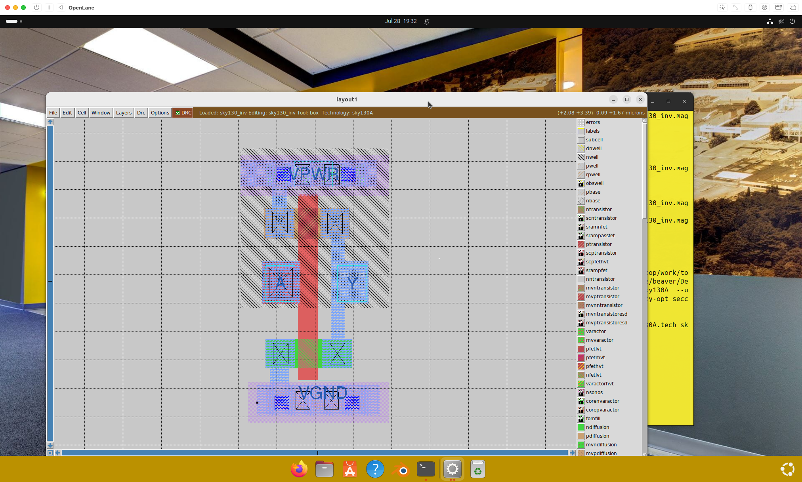

Command parameters breakdown:

- `x_spacing`: Horizontal distance between adjacent vertical tracks
- `y_spacing`: Vertical distance between adjacent horizontal tracks
- `x_origin`: Starting x-coordinate for the grid system
- `y_origin`: Starting y-coordinate for the grid system
- `Purpose`: Aligns routing grids with standard cell dimensions
- `Impact`: Affects routing density and design rule compliance

### LEF File Generation

Write LEFs
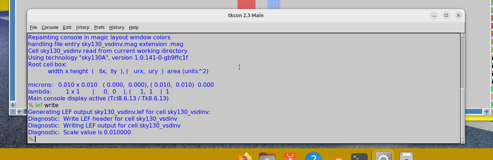

LEF (Library Exchange Format) file creation process:

- `Purpose`: Contains physical information about standard cells
- `Content Includes`:
  - Pin locations and shapes
  - Obstruction layers
  - Cell boundaries
  - Routing guidelines
- `Grid Alignment`: Ensures pins align with routing tracks
- `Tool Integration`: Required for place and route tools

### Flow Integration

Copy the lefs into the picorv32a/src directory, and run the flow:

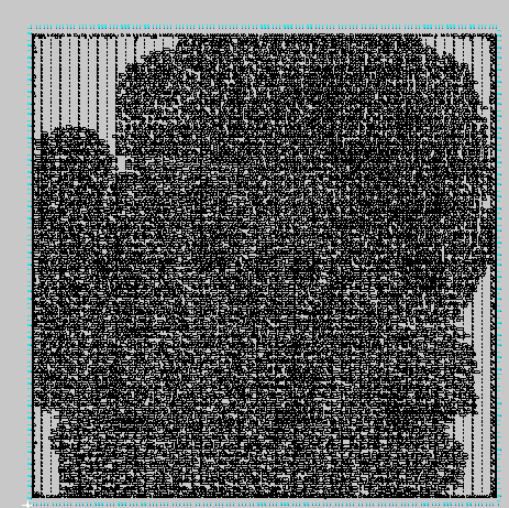

Integration steps:

- `File Placement`: LEF files must be in correct directory structure
- `Tool Recognition`: Place and route tools automatically read LEF files
- `Design Flow`: LEFs used during placement, routing, and timing analysis
- `Verification`: Check that LEF information matches actual cell layouts

## Timing Analysis & Importance of Clock Trees

Poor clock trees can lead to timing violations that are difficult to fix post layout. Layout timing analysis helps identify these issues early int he design cycle by analyzing hte synthesized netlist to estimate timing paths and slack.

### Clock Tree Design Challenges

- `Skew Minimization`: Different path lengths cause clock arrival time variations
- `Insertion Delay`: Total delay from clock source to flip-flops
- `Power Consumption`: Clock networks consume significant portion of total power
- `Signal Integrity`: Clock signals must maintain clean edges and proper voltage levels
- `Process Variations`: Manufacturing variations affect clock distribution

### Timing Violation Types

- `Setup Violations`: Data arrives too late relative to clock edge
- `Hold Violations`: Data changes too soon after clock edge
- `Clock-to-Q Delays`: Time for flip-flop output to change after clock
- `Propagation Delays`: Time for signals to travel through logic gates

### Early Analysis Benefits

- `Design Optimization`: Identify timing issues before physical implementation
- `Architecture Changes`: Modify design structure to improve timing
- `Clock Strategy`: Choose appropriate clocking scheme early
- `Resource Planning`: Estimate buffer and routing resource requirements

## Clock Gating

Clock gating describes gates that are driven in one input by a clock.

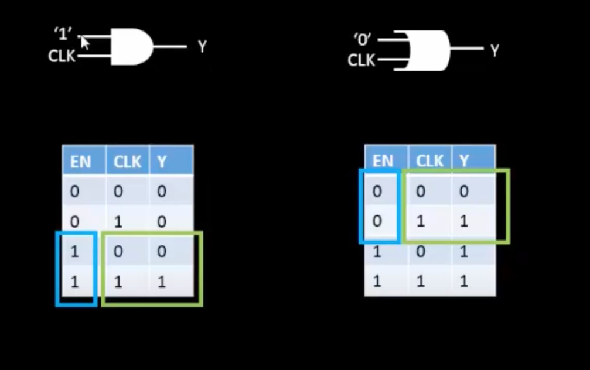

### Clock Gating Fundamentals

- `Definition`: Technique to disable clock signal to parts of circuit when not needed
- `Power Reduction`: Prevents unnecessary switching activity in idle logic
- `Implementation`: Uses AND/OR gates to control clock propagation
- `Enable Signals`: Control when clock reaches specific circuit blocks

### Clock Gating Types

- `Latch-Based Gating`: Uses transparent latches to avoid glitches
- `Integrated Clock Gating (ICG)`: Dedicated library cells for clock gating
- `Fine-Grain Gating`: Individual register level clock control
- `Coarse-Grain Gating`: Block or module level clock control

### Design Considerations

- `Timing Constraints`: Gating signals must be stable before clock edge
- `Glitch Prevention`: Avoid spurious clock pulses during enable transitions
- `Skew Management`: Gated clocks introduce additional skew sources
- `Power vs. Area`: Trade-off between power savings and gate overhead
- `Verification Challenges`: Additional complexity in timing analysis

## Delay Tables

Timing models for standard cells are represented using delay tablest hat characterize the delay of a cell based on input transition times nad output load capacitance.
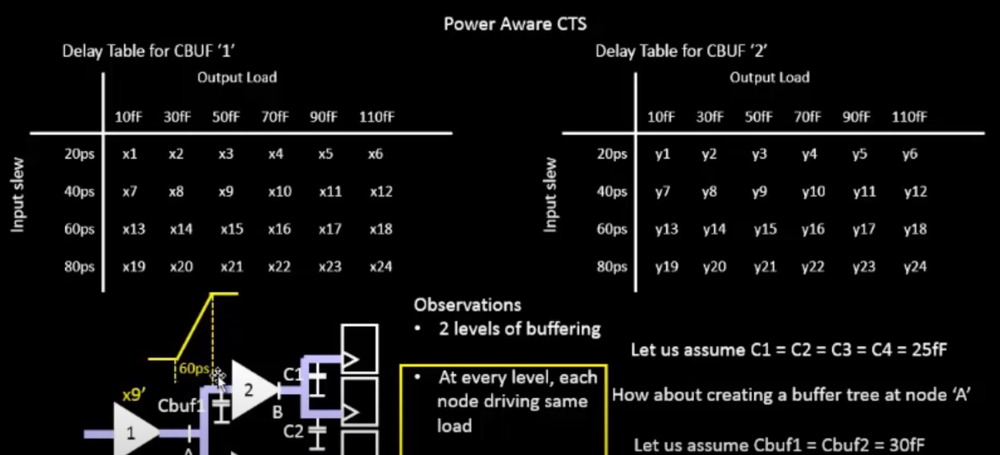

### Delay Table Structure

- `Input Transition Time`: Rise/fall time of input signals affects internal delays
- `Output Load Capacitance`: Capacitive load driven by cell output
- `Lookup Table Format`: 2D tables with interpolation for intermediate values
- `Multiple Timing Arcs`: Separate tables for different input-output paths
- `Process Corners`: Different tables for various manufacturing conditions

### Characterization Parameters

- `Cell Delay`: Time from input transition to output transition
- `Transition Time`: Rise/fall time of output signal
- `Setup/Hold Times`: Timing requirements for sequential elements
- `Power Consumption`: Dynamic and static power under different conditions
- `Noise Margins`: Signal integrity characteristics

### Table Usage in STA

- `Path Delay Calculation`: Sum delays along timing paths using table lookups
- `Interpolation Methods`: Linear or non-linear interpolation between table points
- `Slew Propagation`: Calculate output transition times for downstream cells
- `Load Modeling`: Account for wire and input capacitances
- `Corner Analysis`: Use appropriate tables for worst-case timing analysis

## Timing Analysis with Ideal Clocks using Open STA

### Real Clock vs. Ideal Clock:

`Ideal Clock Characteristics:`

- `Zero Skew`: Clock arrives at all flops at the exact same time (zero skew, zero latency)
- `Perfect Waveform`: Ideal rise/fall times and duty cycle
- `No Jitter`: Clock edges arrive at precisely scheduled times
- `Infinite Drive Strength`: Can drive any load without delay penalty
- `No Physical Implementation`: Abstract timing model for early analysis

`Real Clock Characteristics:`

- `Non-Zero Latency`: STA tool propagates the clock through the actual clock buffers and wires from the post-CTS netlist. This results in each flop having a unique, non-zero clock arrival time (latency), and the difference between these times is the real skew
- `Physical Routing`: Clock travels through actual metal wires with resistance and capacitance
- `Buffer Delays`: Clock passes through multiple buffer stages causing insertion delay
- `Process Variations`: Manufacturing variations affect actual timing
- `Environmental Effects`: Temperature and voltage variations impact performance

### Ideal Clock

Timing checks are done with Ideal Clocks first, at a 1Ghz frequency

OpenSTA is an open-source static timing analysis tool. To perform timing analysis with ideal clocks, you can use a script that:

- Reads the timing libraries and the synthesized netlist.
  Defines the clock with an ideal waveform (zero skew and jitter)

- Sets input and output delays and loads

- Reports timing paths and slack

This analysis provides a baseline for evaluating the design's timing performance before the clock tree is synthesized.

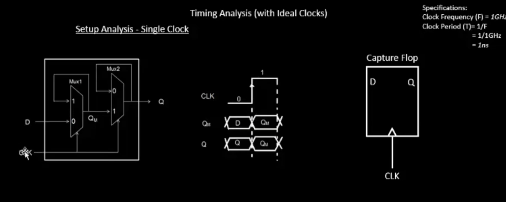

### OpenSTA Analysis Process

- `Library Loading`: Read standard cell timing models (.lib files)
- `Netlist Import`: Load synthesized gate-level netlist
- `Clock Definition`: Specify clock frequency, duty cycle, and ideal characteristics
- `Constraint Setting`: Define input/output delays and drive strengths
- `Path Analysis`: Calculate critical timing paths through combinational logic

### Ideal Clock Benefits

- `Baseline Establishment`: Provides reference point for timing optimization
- `Logic Evaluation`: Focus on combinational logic delays without clock overhead
- `Early Detection`: Identify fundamental timing issues before physical design
- `Optimization Guidance`: Shows which paths need attention before CTS
- `Design Validation`: Verify that logic implementation meets timing goals

### Setup Timing

Setup time is the minimum time that the data input of a flip-flop must be stable before the clock edge arrives. Setup timing analysis ensures that this requirement is met for all flip-flops in the design. The analysis calculates the data arrival time and the clock arrival time at each flip-flop and checks that the data arrives before the required setup time.

### Setup Timing Analysis Components

- `Data Arrival Time`: Time when data signal reaches flip-flop input
- `Clock Arrival Time`: Time when clock edge reaches flip-flop
- `Setup Requirement`: Minimum time data must be stable before clock
- `Setup Slack`: Difference between required time and arrival time
- `Critical Paths`: Timing paths with worst (most negative) slack

### Setup Violation Causes

- `Long Combinational Paths`: Too much logic between flip-flops
- `High Load Capacitance`: Excessive fanout slowing signal propagation
- `Process Variations`: Slow corner conditions increase delays
- `Clock Skew`: Clock arrives early at launching flop, late at capturing flop
- `Environmental Conditions`: High temperature and low voltage increase delays

### Setup Analysis Results

OpenSTA results:
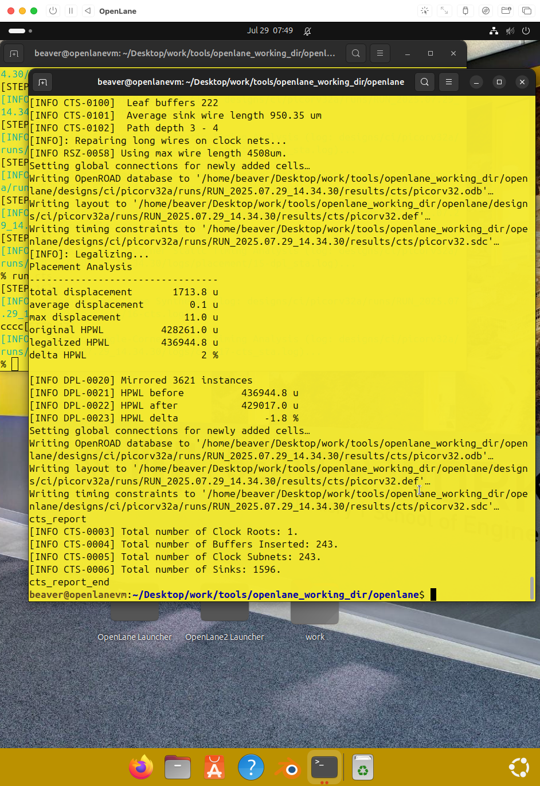
Slack:
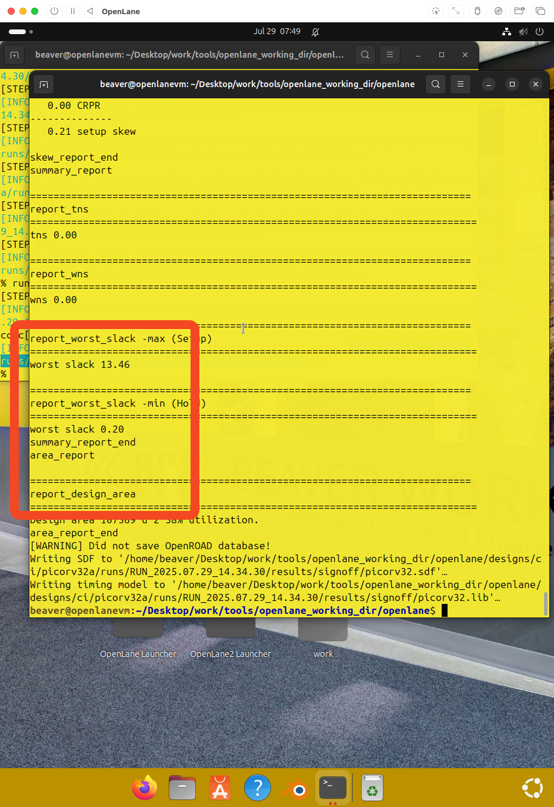
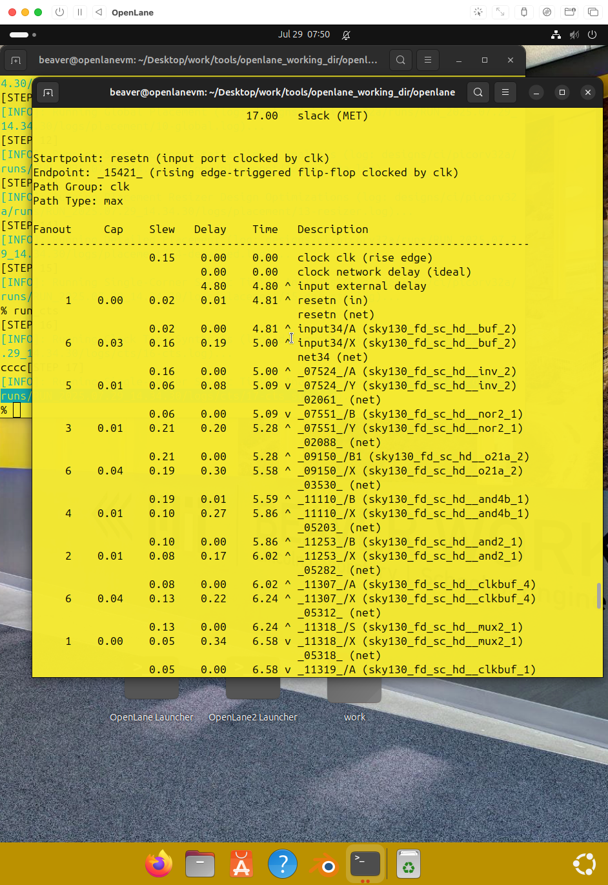

### Slack Interpretation

- `Positive Slack`: Timing requirement met with margin
- `Zero Slack`: Timing requirement just barely met
- `Negative Slack`: Timing violation - data arrives too late
- `Worst Slack`: Most critical timing path in design
- `Total Negative Slack (TNS)`: Sum of all negative slacks

Running CTS with OpenRoad:
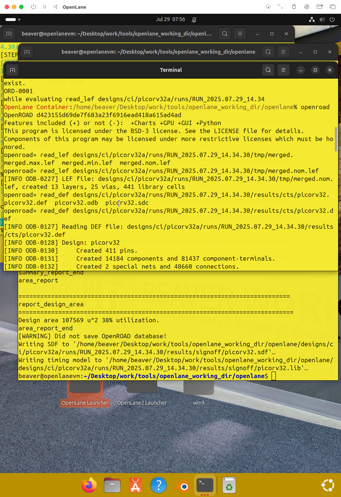

Because OpenRoad could not find my enviorment variable, I could not continue. I was unable to find a solution to this, but penroad shoul dhave provided reports about the skew, as well as timing information for the inputs and clocks.

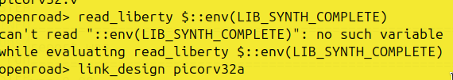

### Clock Jitter/Uncertainty

Clock jitter is the variation in the arrival time of the clock edge from its ideal position

Clock uncertainty is a measure of the total timing uncertainty in the clock path, including jitter and other variations

Such factors can reduce the available time for data to propagate through the logic, making it more difficult to meet timing requirements

### Types of Clock Jitter

- `Period Jitter`: Variation in clock period from cycle to cycle
- `Cycle-to-Cycle Jitter`: Difference in period between adjacent cycles
- `Absolute Jitter`: Total deviation from ideal clock edge timing
- `Random Jitter`: Unpredictable variations due to noise sources
- `Deterministic Jitter`: Predictable patterns in timing variations

### Sources of Clock Uncertainty

- `PLL Jitter`: Phase-locked loops introduce timing variations
- `Supply Noise`: Power supply fluctuations affect clock generation
- `Temperature Variations`: Thermal changes impact circuit delays
- `Process Variations`: Manufacturing tolerances create timing differences
- `Crosstalk`: Adjacent signal switching affects clock signal integrity

### Impact on Timing Analysis

- `Setup Time Reduction`: Jitter reduces available setup time window
- `Hold Time Increase`: Clock uncertainty affects hold time requirements
- `Margin Reduction`: Less timing margin available for logic delays
- `Design Constraints`: Must account for worst-case jitter scenarios
- `Clock Domain Crossing`: Increased complexity for multi-clock designs

## Clock Tree Synthesis TritonCTS and Signal Integrity

TritonCTS is a clock tree synthesis tool that is part of the OpenROAD project. It builds a balanced clock tree to minimize skew and insertion delay. Signal integrity is a major concern in clock tree design, as the clock signals must be clean and free of noise.

TritonCTS uses techniques such as buffer insertion and wire sizing to maintain signal integrity throughout the clock tree.

### TritonCTS Features

- `Skew Optimization`: Minimizes clock arrival time differences across flip-flops
- `Insertion Delay Control`: Manages total delay from clock source to endpoints
- `Power Optimization`: Reduces clock network power consumption
- `Multi-Corner Analysis`: Handles multiple process/voltage/temperature corners
- `Useful Skew`: Intentionally introduces skew to improve timing

### Clock Tree Synthesis Objectives

- `Zero Skew`: Ideal goal of simultaneous clock arrival at all flip-flops
- `Minimum Insertion Delay`: Reduce total clock path delay
- `Power Minimization`: Use minimum number and size of buffers
- `Signal Integrity`: Maintain clean clock waveforms
- `Electromigration Prevention`: Avoid excessive current density in wires

### Signal Integrity Challenges

- `Crosstalk`: Coupling between clock and data nets causes noise
- `Power Supply Noise`: IR drop affects clock buffer performance
- `Process Variations`: Manufacturing tolerances impact clock distribution
- `Temperature Gradients`: Thermal variations create timing skew
- `Electromigration`: High current density can cause wire degradation

### TritonCTS Techniques

- `Buffer Insertion`: Strategic placement of clock buffers for drive strength
- `Wire Sizing`: Optimize wire widths for delay and power trade-offs
- `Clock Gating Integration`: Handle gated clock domains during synthesis
- `Multi-VT Usage`: Use different threshold voltage cells for optimization
- `Clock Mesh Networks`: Alternative to tree structures for large designs

## Clock Tree Routing and Buffering Using H-Tree Algorithms

The H-tree algorithm creates a fractal-like structure that ensures that the path length from the clock source to each flip-flop is the same—if this time is not the same, the clock signal will arrive at hte flip flops at different times.

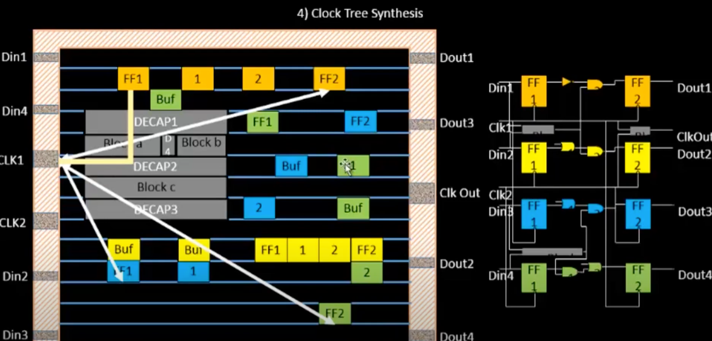

Buffering is used to restore the signal strength and reduce
delay in the clock tree.

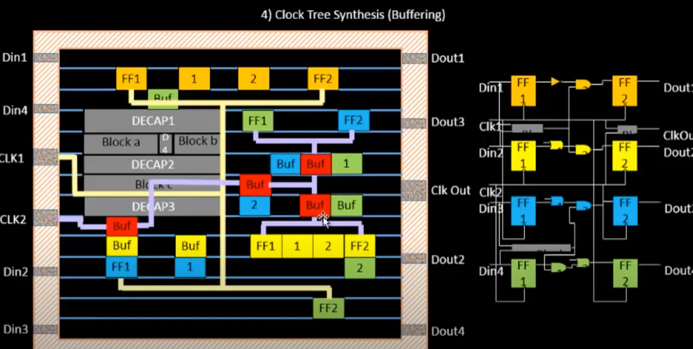

The H-tree algorithm helps to create a balanced clock tree with low skew and good signal integrity.

### H-Tree Algorithm Principles

- `Fractal Structure`: Recursive pattern that scales with design size
- `Equal Path Lengths`: Geometric symmetry ensures uniform delays
- `Binary Branching`: Each level splits into two equal branches
- `Center-Out Construction`: Build from center toward endpoints
- `Scalable Architecture`: Works for designs of varying complexity

### H-Tree Construction Steps

- `Root Placement`: Position clock source at geometric center
- `Level Creation`: Build tree levels with equal branch lengths
- `Endpoint Connection`: Connect final branches to flip-flop locations
- `Buffer Insertion`: Add buffers at strategic branching points
- `Wire Sizing`: Optimize wire widths for each tree level

### Buffer Insertion Strategy

- `Drive Strength Matching`: Size buffers according to load requirements
- `Slew Control`: Maintain acceptable signal transition times
- `Power Optimization`: Minimize buffer count while meeting timing
- `Level-by-Level Sizing`: Larger buffers at higher tree levels
- `Load Balancing`: Distribute capacitive loads evenly

### H-Tree Advantages

- `Predictable Skew`: Geometric symmetry provides inherent balance
- `Scalability`: Works well for large and small designs
- `Regularity`: Simplifies routing and verification
- `Power Efficiency`: Minimal buffer usage for given skew target
- `Design Reuse`: Tree structure can be reused across designs

### H-Tree Limitations

- `Placement Constraints`: Requires specific flop placement patterns
- `Routing Congestion`: May create hotspots at tree intersections
- `Non-Uniform Loads`: Difficult to handle varying endpoint loads
- `Physical Obstacles`: Blockages can disrupt symmetric structure
- `Process Variations`: Manufacturing differences affect balance

## Crosswalk and Clock Net Shielding

Crosstalk is the unwanted coupling of signals between adjacent wires.
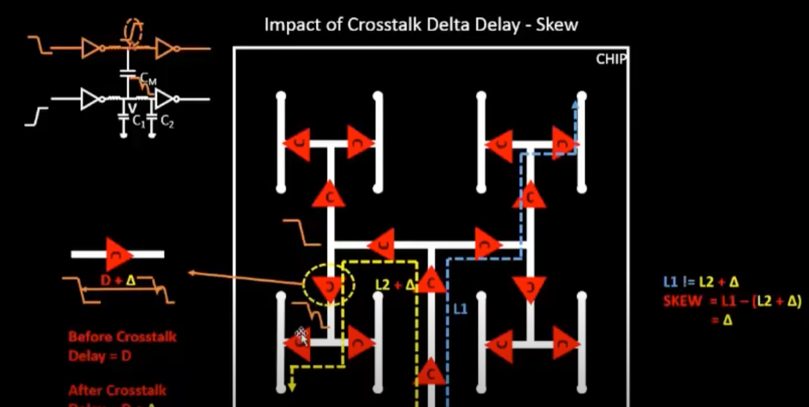

It can cause noise and timing variations on the clock nets, leading to functional failures.

Clock net shielding is a technique used to protect the clock nets from crosstalk by surrounding the clock nets with ground or power wires, which act as a shield and prevent coupling from other signals

### Crosstalk Mechanisms

- `Capacitive Coupling`: Adjacent wires create capacitive paths for noise transfer
- `Inductive Coupling`: Current changes in one wire induce voltages in nearby wires
- `Mutual Capacitance`: Shared electric fields between parallel conductors
- `Mutual Inductance`: Shared magnetic fields from current-carrying conductors
- `Substrate Coupling`: Noise propagation through semiconductor substrate

### Crosstalk Effects on Clock Signals

- `Timing Jitter`: Random variations in clock edge arrival times
- `Duty Cycle Distortion`: Unequal high and low periods in clock waveform
- `Voltage Noise`: Spurious voltage levels that can cause false triggering
- `Slew Rate Changes`: Altered rise/fall times affecting downstream logic
- `Functional Failures`: Logic errors due to corrupted clock signals

### Clock Net Shielding Techniques

- `Ground Shielding`: Surround clock nets with grounded conductors
- `Power Shielding`: Use power rails as shield conductors
- `Differential Signaling`: Use complementary clock pairs for noise immunity
- `Physical Separation`: Increase spacing between clock and data nets
- `Layer Assignment`: Place clock nets on dedicated routing layers

### Shielding Implementation Methods

- `Side Shielding`: Ground/power wires on both sides of clock net
- `Top/Bottom Shielding`: Shielding on upper and lower metal layers
- `Complete Enclosure`: Surround clock net on all sides with shields
- `Strategic Placement`: Shield only critical clock net segments
- `Via Shielding`: Protect vertical connections between metal layers

### Design Trade-offs

- `Area Overhead`: Shielding increases routing resource requirements
- `Power Consumption`: Additional metal and vias increase capacitance
- `Routing Complexity`: More constraints on placement and routing tools
- `Cost vs. Benefit`: Balance shielding cost against noise immunity needs
- `Manufacturing Impact`: Additional metal layers may affect yield
